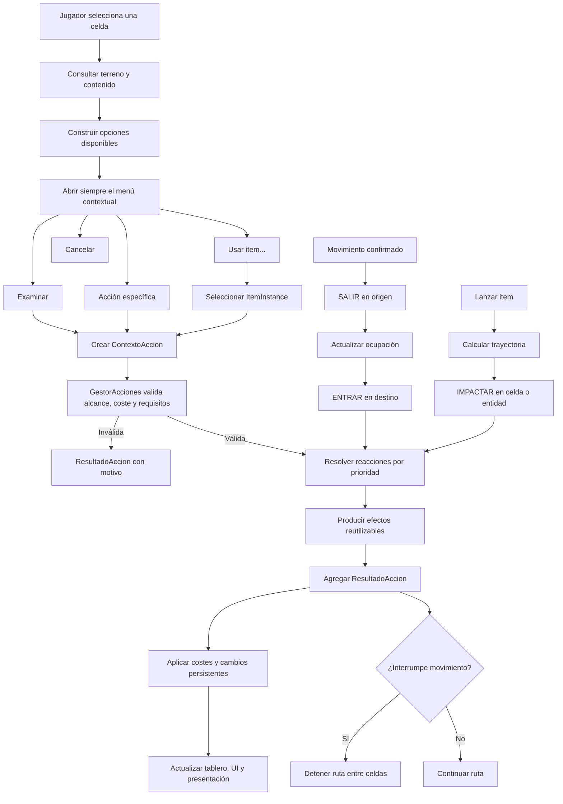

# Exhume — Roadmap del sistema de interacciones y eventos en celdas

> Registro técnico vivo para el equipo y futuras sesiones de Codex.
>
> Documento humano complementario: [Plan del sistema de interacciones (PDF)](Plan_sistema_interacciones_Exhume.pdf).

## Estado general

- Estado actual: diseño aprobado; implementación todavía no iniciada.
- Próximo hito: **Interacción básica** (fases 0 a 4).
- Primera vertical slice: una palanca colocada en el mapa que pueda examinarse y accionarse desde un menú contextual obligatorio.
- Última actualización de este registro: 11 de agosto de 2026.

### Progreso por fases

- [ ] Fase 0 — Contratos y vocabulario.
- [ ] Fase 1 — Núcleo de acciones.
- [ ] Fase 2 — Entidad interactuable base.
- [ ] Fase 3 — Examinar e información progresiva.
- [ ] Fase 4 — Menú contextual obligatorio.
- [ ] Fase 5 — Reacciones automáticas al movimiento.
- [ ] Fase 6 — Sistema de efectos.
- [ ] Fase 7 — Items e inventario mínimo.
- [ ] Fase 8 — Usar items sobre objetivos.
- [ ] Fase 9 — Lanzamiento, trayectoria e impacto.
- [ ] Fase 10 — Relaciones y mecanismos.
- [ ] Fase 11 — Turnos y efectos persistentes.
- [ ] Fase 12 — Persistencia.
- [ ] Fase 13 — Herramientas de diseño y depuración.

Cuando una fase comience, se debe cambiar su casilla y registrar debajo de ella:

1. Fecha de inicio.
2. Responsable o sesión que trabajó en ella.
3. Decisiones tomadas.
4. Archivos modificados.
5. Pruebas realizadas.
6. Deuda técnica o trabajo pendiente.

## Objetivo del sistema

El sistema debe permitir que una celda, su terreno y las entidades que contiene reaccionen de forma coherente a acciones de distinta naturaleza. No se limitará a caminar sobre lava o activar una trampa: debe servir como base para examinar, abrir, recoger, empujar, utilizar herramientas, lanzar objetos, recibir impactos, activar mecanismos y procesar efectos temporales.

La intención es permitir combinaciones emergentes sin programar manualmente cada pareja posible de item y objetivo. Por ejemplo, la lava no debería conocer específicamente un `FrascoDeAgua`. Debería reaccionar ante una acción que aporte propiedades como `agua` y una magnitud de volumen determinada. Cualquier item futuro capaz de aportar esas propiedades podría provocar una reacción compatible.

## Decisiones ya acordadas

Estas decisiones constituyen la dirección inicial del diseño. Si se cambian, se debe documentar el motivo en este archivo.

### El menú contextual siempre aparece

Al solicitar una interacción voluntaria siempre se abre un menú, incluso si solo existe una acción posible. El menú básico debe contemplar:

- `Examinar` o `Inspeccionar`.
- Las acciones específicas disponibles.
- `Usar item…` cuando corresponda.
- `Cancelar`.

Las opciones imposibles pueden mostrarse deshabilitadas cuando conocer el requisito sea útil para el jugador. Las acciones secretas no deben mostrarse antes de ser descubiertas.

### Examinar es una acción central

Examinar permite obtener información relevante, pero no revela necesariamente todos los datos internos. La información disponible podrá depender de:

- Estado visible del objetivo.
- Iluminación y distancia.
- Atributos o habilidades del personaje.
- Herramientas disponibles.
- Conocimiento adquirido anteriormente.
- Descubrimientos realizados en inspecciones previas.

Se prevén niveles de información como `VISIBLE`, `BASICO`, `DETALLADO` y `SECRETO`.

### Definición, instancia y representación son conceptos distintos

Cada interactuable o item debe separar:

- **Definición:** datos reutilizables que indican qué es y qué capacidades tiene.
- **Instancia:** estado particular durante una partida.
- **Representación:** escena, sprite, animación, sonido y posición en el mundo.

Una puerta puede compartir una misma definición con muchas otras puertas. Cada instancia conserva si está abierta, bloqueada, dañada o examinada. La escena se ocupa de representarla y comunicar sus cambios visualmente.

### Los interactuables usarán un sistema híbrido

- Los elementos con identidad, estado o comportamiento propio serán escenas.
- Los terrenos y fenómenos masivos o estáticos continuarán representados mediante tiles.
- Podrá existir una capa invisible de marcadores para pintar posiciones rápidamente y generar escenas al cargar la zona.
- Los elementos únicos podrán colocarse directamente como escenas desde el editor.

Estructura prevista de una zona:

```text
Zona1
├── CapaSuelo
├── CapaAgua
├── CapaLava
├── CapaParedes
├── CapaDecoracion
├── Interactuables
│   ├── Puerta01
│   ├── Cofre01
│   ├── Palanca01
│   └── Trampa01
├── CapaMarcadoresInteractuables   # opcional, solo para diseño/generación
└── CapaOscuridad
```

### Las acciones y resultados deben ser estructurados

La lógica no debe depender de llamadas aisladas ni limitarse a modificar valores y ejecutar `print()`. Toda acción transportará un contexto y toda resolución devolverá un resultado que otras partes del juego puedan interpretar.

Contrato conceptual de una acción:

```text
ContextoAccion
├── tipo
├── actor
├── origen
├── celda_objetivo
├── objetivo_concreto
├── item
├── etiquetas
├── magnitudes
├── alcance
└── metadatos
```

Contrato conceptual de un resultado:

```text
ResultadoAccion
├── exitosa
├── consumio_accion
├── consumio_turno
├── interrumpe_movimiento
├── mensajes
├── efectos_aplicados
├── cambios_estado
└── recursos_consumidos
```

### Los items aportan capacidades, no excepciones específicas

Algunos ejemplos de información semántica que podrán aportar los items:

```text
Piedra
├── etiquetas: impacto, contundente, arrojable
└── peso: 3

Frasco de agua
├── etiquetas: agua, liquido, arrojable
└── volumen: 2

Antorcha
├── etiquetas: fuego, calor, luz, inflamable
└── intensidad: 1
```

El objetivo recibe estas propiedades dentro del contexto de la acción y decide si puede reaccionar.

## Integración prevista con el proyecto actual

El proyecto ya dispone de componentes importantes sobre los que se construirá el sistema:

- [`TableroGrid`](scripts/tablero_grid.gd) mantiene las celdas, ocupación, reservas, iluminación y propiedades del terreno.
- [`Celda`](scripts/celda.gd) representa el estado lógico de cada coordenada.
- [`Ficha`](scenes/ficha/ficha.gd) ejecuta movimiento paso a paso y puede interrumpir una ruta.
- [`EscenarioBase`](scenes/escenario_base/escenario_base.gd) coordina input, movimiento, tablero y visión.
- [`PathFindingManager`](scripts/pathfinding_manager.gd) calcula rutas y considera obstáculos y costes del terreno.
- [`FOVManager`](scripts/fov_manager.gd) resuelve iluminación y visibilidad.

El flujo de movimiento previsto será:

```text
Confirmar paso
→ emitir SALIR en la celda de origen
→ actualizar ocupación
→ emitir ENTRAR en la celda de destino
→ resolver terreno, efectos, interactuables y ocupantes
→ agregar resultados
→ aplicar consecuencias
→ continuar o interrumpir la ruta
```

La llegada debe confirmarse antes de resolver `ENTRAR`. Si una reacción interrumpe el movimiento, la ficha se detiene entre pasos y nunca a mitad de la animación entre dos celdas.

---

## Fase 0 — Contratos y vocabulario

### Objetivo

Definir el lenguaje común del sistema antes de introducir clases y dependencias. Esta fase evita que distintas implementaciones usen nombres incompatibles para el mismo concepto o mezclen acción, reacción, efecto y resultado.

### Trabajo previsto

- Definir qué es una acción solicitada por el jugador, una acción automática y una reacción.
- Definir qué es un efecto y cómo se diferencia de la reacción que lo produce.
- Acordar los tipos iniciales de acciones:
  - `EXAMINAR`.
  - `INTERACTUAR`.
  - `ENTRAR`.
  - `SALIR`.
  - `USAR_ITEM`.
  - `LANZAR_ITEM`.
  - `IMPACTAR`.
  - `RECOGER`.
  - `SOLTAR`.
  - `FIN_TURNO`.
- Definir un catálogo inicial de etiquetas semánticas.
- Definir cómo se representan magnitudes como peso, volumen, intensidad, temperatura o potencia.
- Definir el orden de resolución cuando una celda contiene varias reacciones.
- Acordar qué resultados consumen energía, una acción, un turno, cargas o items.
- Establecer las diferencias entre éxito, fallo, bloqueo e interrupción.
- Definir los niveles de información para Examinar.

### Entregables

- Contratos conceptuales de `ContextoAccion`, `ResultadoAccion` y `OpcionAccion`.
- Lista inicial de tipos de acción.
- Catálogo inicial de etiquetas y reglas para agregar nuevas.
- Reglas de prioridad y agregación de resultados.
- Convenciones de nombres en español o inglés para código y contenido.

### Criterio de cierre

La fase termina cuando el equipo puede describir el flujo completo de una palanca, una trampa y un item arrojado sin introducir términos contradictorios ni excepciones específicas.

### Registro de implementación

- Estado: pendiente.
- Decisiones nuevas: —
- Archivos modificados: —
- Pruebas: —
- Pendientes: —

## Fase 1 — Núcleo de acciones

### Objetivo

Implementar el canal común por el que pasarán todas las interacciones automáticas y voluntarias.

### Trabajo previsto

- Crear `ContextoAccion` con actor, coordenadas, objetivo, item, etiquetas y magnitudes.
- Crear `ResultadoAccion` con éxito, mensajes, efectos, costes e interrupción.
- Crear `OpcionAccion` para representar cada entrada del menú sin acoplarla a la interfaz.
- Crear `GestorAcciones` como coordinador de validación y resolución.
- Añadir señales de inicio, resolución y finalización.
- Definir validaciones comunes:
  - Actor válido.
  - Objetivo válido.
  - Alcance.
  - Línea de efecto cuando corresponda.
  - Requisitos.
  - Costes disponibles.
- Permitir que una acción inválida devuelva un motivo comprensible sin producir efectos.
- Mantener el núcleo independiente de puertas, palancas, lava, inventario y UI.

### Entregables

- Clases o Resources que implementen los tres contratos principales.
- `GestorAcciones` integrado de forma mínima en una escena de prueba.
- Pruebas unitarias o escenas de prueba para éxito y fallo.
- Registro legible del ciclo de una acción durante desarrollo.

### Criterio de cierre

Una acción artificial puede enviarse a un receptor de prueba y devuelve un resultado estructurado. Los fallos incluyen motivos y no modifican estado.

### Registro de implementación

- Estado: pendiente.
- Decisiones nuevas: —
- Archivos modificados: —
- Pruebas: —
- Pendientes: —

## Fase 2 — Entidad interactuable base

### Objetivo

Representar objetos del mundo con identidad, definición reutilizable, coordenada y estado persistente.

### Trabajo previsto

- Crear una clase base `Interactuable`.
- Crear `InteractuableDefinition` como Resource reutilizable.
- Asignar un ID estable a cada instancia persistente.
- Registrar y desregistrar interactuables en `TableroGrid`.
- Ampliar `Celda` para distinguir claramente:
  - Ocupantes.
  - Reservas.
  - Interactuables.
  - Items en el suelo.
  - Efectos de superficie.
  - Iluminación.
- Crear un nodo `Interactuables` dentro de las zonas.
- Definir el ciclo de vida al cargar, mover o destruir una entidad.
- Permitir que un interactuable publique opciones sin conocer el menú que las mostrará.
- Preparar componentes de reacción modulares, evitando una clase base gigantesca.

### Entregables

- Clase y definición base.
- Registro espacial desde el tablero.
- Palanca de prueba colocable desde el editor.
- Validación de IDs duplicados al menos durante desarrollo.

### Criterio de cierre

Una palanca colocada como escena aparece en la celda correcta, publica sus acciones y conserva un estado activado/desactivado sin lógica especial en `EscenarioBase`.

### Registro de implementación

- Estado: pendiente.
- Decisiones nuevas: —
- Archivos modificados: —
- Pruebas: —
- Pendientes: —

## Fase 3 — Examinar e información progresiva

### Objetivo

Implementar Examinar como un mecanismo general para obtener y recordar información del mundo.

### Trabajo previsto

- Crear la acción `EXAMINAR`.
- Permitir examinar terreno, interactuables, items y ocupantes.
- Separar descripción visible, información básica, detalle mecánico y secretos.
- Definir qué información se recuerda después de descubrirla.
- Evaluar condiciones como iluminación, distancia, percepción y herramientas.
- Permitir que una inspección falle, sea parcial o revele información nueva.
- Evitar que la descripción exponga directamente variables internas o contenido destinado al diseñador.
- Preparar mensajes localizables o identificadores de texto para el futuro.

### Entregables

- Componente o proveedor común de información examinable.
- Estructura de datos para información descubierta.
- Presentación inicial del resultado en UI.
- Caso de prueba con una placa aparentemente normal que puede descubrirse como mecanismo.

### Criterio de cierre

Examinar el mismo objetivo en condiciones distintas produce información coherente y los descubrimientos relevantes permanecen registrados.

### Registro de implementación

- Estado: pendiente.
- Decisiones nuevas: —
- Archivos modificados: —
- Pruebas: —
- Pendientes: —

## Fase 4 — Menú contextual obligatorio

### Objetivo

Convertir toda interacción voluntaria en una elección explícita y extensible.

### Flujo previsto

```text
Seleccionar celda
→ consultar objetivos perceptibles
→ elegir objetivo si existen varios
→ construir OpcionAccion[]
→ abrir siempre el menú
→ seleccionar Examinar / acción / Usar item / Cancelar
→ validar
→ resolver
→ presentar ResultadoAccion
```

### Trabajo previsto

- Diseñar un menú que siempre aparezca.
- Mantener `Examinar` como opción habitual.
- Mostrar acciones habilitadas y, cuando sea útil, acciones deshabilitadas con explicación.
- Resolver la presencia de varios objetivos en la misma celda.
- Incluir `Usar item…` sin implementar aún el inventario completo.
- Permitir cancelar sin coste.
- Bloquear input de movimiento mientras el menú esté abierto.
- Preparar navegación con ratón, teclado y gamepad.
- Evitar que cada interactuable cree o modifique controles de UI.

### Entregables

- Componente reutilizable de menú contextual.
- Adaptador entre `OpcionAccion` y la interfaz.
- Flujo completo para la palanca de prueba.
- Mensajes claros para acciones bloqueadas.

### Criterio de cierre

Interactuar con una palanca siempre abre un menú con `Examinar`, `Accionar` y `Cancelar`; todas las opciones producen resultados coherentes y el menú no conoce la implementación de la palanca.

### Registro de implementación

- Estado: pendiente.
- Decisiones nuevas: —
- Archivos modificados: —
- Pruebas: —
- Pendientes: —

## Fase 5 — Reacciones automáticas al movimiento

### Objetivo

Integrar las acciones `ENTRAR` y `SALIR` con el movimiento celda por celda que ya existe.

### Trabajo previsto

- Emitir `SALIR` después de completar el paso desde el origen.
- Confirmar la ocupación del destino antes de emitir `ENTRAR`.
- Consultar terreno, efectos de superficie, interactuables y ocupantes.
- Definir prioridades de reacción.
- Agregar todos los resultados antes de decidir si continúa la ruta.
- Interrumpir el recorrido ante daño crítico, inmovilización, trampa o encuentro.
- Evitar que una reacción se ejecute dos veces por el mismo paso.
- Resolver correctamente una ruta que queda obsoleta.
- Mantener separado el consumo normal de movimiento de los costes adicionales del terreno.

### Primeros casos de contenido

- Lava que produce daño al entrar.
- Terreno difícil que consume energía adicional.
- Placa de presión que reacciona al peso.
- Trampa que aplica efectos e interrumpe la ruta.

### Criterio de cierre

La ficha camina sobre una trampa, completa el paso, activa exactamente una reacción, aplica sus efectos y se detiene correctamente en la celda.

### Registro de implementación

- Estado: pendiente.
- Decisiones nuevas: —
- Archivos modificados: —
- Pruebas: —
- Pendientes: —

## Fase 6 — Sistema de efectos

### Objetivo

Desacoplar las reacciones de sus consecuencias mecánicas para reutilizar la misma lógica en terrenos, trampas, items, combate y estados.

### Efectos iniciales previstos

- Daño.
- Curación.
- Modificación de energía.
- Aplicación o eliminación de un estado.
- Movimiento forzado.
- Cambio de propiedad o estado interno.
- Encender o apagar.
- Crear, transformar o eliminar una entidad.
- Transformar terreno.
- Revelar información.
- Emitir ruido.
- Interrumpir movimiento.

### Trabajo previsto

- Definir un contrato común para efectos.
- Definir origen, receptor, tipo, magnitud y etiquetas del efecto.
- Permitir efectos instantáneos y preparar efectos diferidos.
- Definir orden y reglas de acumulación.
- Evitar que un efecto manipule UI directamente.
- Integrar presentación mediante señales o eventos derivados.
- Permitir componer una reacción con varios efectos.

### Criterio de cierre

El mismo efecto de daño se reutiliza sin modificaciones en lava, una trampa y un impacto de proyectil de prueba.

### Registro de implementación

- Estado: pendiente.
- Decisiones nuevas: —
- Archivos modificados: —
- Pruebas: —
- Pendientes: —

## Fase 7 — Items e inventario mínimo

### Objetivo

Introducir items con definiciones reutilizables, instancias persistentes y presencia tanto en inventario como en el mundo.

### Modelo previsto de `ItemDefinition`

```text
id
nombre
descripcion_base
icono
escena_mundo
categorias
etiquetas
propiedades
apilable
cantidad_maxima
peso
volumen
valor
acciones_provistas
componentes
```

### Modelo previsto de `ItemInstance`

```text
instance_id
definition_id
cantidad
durabilidad
cargas
estado
propietario_id
```

### Trabajo previsto

- Crear un registro de definiciones por ID.
- Implementar inventario mínimo sin comprometer todavía la UI definitiva.
- Definir apilamiento y separación de instancias.
- Implementar cargas, cantidad y durabilidad.
- Registrar items presentes en una celda.
- Implementar `RECOGER` y `SOLTAR` mediante `GestorAcciones`.
- Convertir un item entre representación en inventario y representación en el mundo.
- Preparar serialización desde el comienzo.

### Criterio de cierre

Una piedra puede recogerse, mantiene el mismo `instance_id` y estado, y puede soltarse en otra celda donde queda registrada y visible.

### Registro de implementación

- Estado: pendiente.
- Decisiones nuevas: —
- Archivos modificados: —
- Pruebas: —
- Pendientes: —

## Fase 8 — Usar items sobre objetivos

### Objetivo

Conectar inventario e interactuables mediante la acción general `USAR_ITEM`.

### Flujo previsto

```text
Menú contextual
→ Usar item…
→ seleccionar una instancia del inventario
→ construir ContextoAccion con etiquetas y magnitudes
→ validar requisitos
→ resolver reacciones del objetivo
→ consumir, modificar o conservar el item según el resultado
```

### Trabajo previsto

- Crear un selector de item compatible con el menú contextual.
- Decidir si se muestran todos los items o una lista filtrada con opción de ver el resto.
- Diferenciar intento inválido, uso válido y resultado parcial.
- Definir cuándo se consume una carga, cantidad, durabilidad o el item completo.
- Permitir herramientas que no se consumen.
- Permitir items que cambian de estado al usarse.
- Permitir que una acción coloque el item dentro o junto al objetivo.

### Casos de validación

- Llave sobre una puerta compatible.
- Agua sobre fuego.
- Herramienta sobre un mecanismo.
- Antorcha sobre un elemento inflamable.

### Criterio de cierre

Los casos anteriores se resuelven mediante etiquetas, magnitudes y componentes reutilizables, sin lógica especial item-objetivo dentro de `GestorAcciones`.

### Registro de implementación

- Estado: pendiente.
- Decisiones nuevas: —
- Archivos modificados: —
- Pruebas: —
- Pendientes: —

## Fase 9 — Lanzamiento, trayectoria e impacto

### Objetivo

Extender el sistema de acciones a interacciones a distancia utilizando los mismos items y reacciones.

### Flujo previsto

```text
Seleccionar LANZAR_ITEM
→ seleccionar item
→ calcular rango y trayectoria
→ previsualizar destino
→ reservar o retirar item
→ animar lanzamiento
→ determinar primera colisión
→ emitir IMPACTAR
→ resolver reacciones
→ romper, consumir, transformar o dejar caer el item
```

### Trabajo previsto

- Calcular alcance según actor, item, peso y reglas futuras.
- Representar trayectoria sobre el tablero.
- Resolver paredes, obstáculos, altura y ocupantes.
- Determinar la celda real de impacto.
- Añadir precisión o desviación solamente si el diseño lo necesita.
- Resolver rotura, rebote y caída.
- Colocar en el mundo el item sobreviviente.
- Permitir que el impacto aporte peso, fuerza, daño y etiquetas.

### Casos de validación

- Una piedra activa una placa de presión.
- Un frasco de agua se rompe y apaga fuego.
- Un item choca con una pared y cae antes del destino seleccionado.
- Un objeto pesado produce mayor impacto que uno ligero.

### Criterio de cierre

La trayectoria visual coincide con la resolución lógica y ningún item desaparece o se duplica durante éxito, fallo, colisión o interrupción.

### Registro de implementación

- Estado: pendiente.
- Decisiones nuevas: —
- Archivos modificados: —
- Pruebas: —
- Pendientes: —

## Fase 10 — Relaciones y mecanismos

### Objetivo

Permitir que palancas, placas, puertas, luces, trampas y otros elementos se comuniquen sin depender de rutas de nodo frágiles.

### Trabajo previsto

- Crear canales, IDs de mecanismo o un sistema equivalente.
- Definir emisores y receptores.
- Emitir eventos como activado, desactivado, destruido o restablecido.
- Permitir un emisor con varios receptores y viceversa.
- Preparar acciones temporizadas o retardadas.
- Soportar estados reversibles.
- Mostrar y editar relaciones desde el inspector.
- Validar referencias inexistentes o duplicadas.

### Caso de validación

Una palanca emite sobre el canal `puerta_cripta`; una puerta se abre y dos luces se encienden. Al volver a accionar la palanca, el comportamiento reversible se aplica según su configuración.

### Criterio de cierre

Los mecanismos conectados funcionan después de reorganizar nodos o reinstanciar la zona porque sus relaciones no dependen de `NodePath` externos inestables.

### Registro de implementación

- Estado: pendiente.
- Decisiones nuevas: —
- Archivos modificados: —
- Pruebas: —
- Pendientes: —

## Fase 11 — Turnos y efectos persistentes

### Objetivo

Procesar reacciones y efectos que duran varios turnos, se propagan o se activan más tarde.

### Trabajo previsto

- Definir inicio y fin de turno.
- Integrar la acción `FIN_TURNO`.
- Crear duración, acumulación y expiración de estados.
- Implementar enfriamientos.
- Preparar fuego propagable y superficies transformables.
- Implementar veneno, sangrado, quemadura u otros estados de prueba.
- Introducir ruido y alertas para futuros enemigos.
- Permitir mecanismos retardados.
- Mantener orden determinista de resolución.

### Criterio de cierre

Una misma secuencia de acciones y turnos siempre produce el mismo resultado, incluyendo expiración, propagación e interrupciones.

### Registro de implementación

- Estado: pendiente.
- Decisiones nuevas: —
- Archivos modificados: —
- Pruebas: —
- Pendientes: —

## Fase 12 — Persistencia

### Objetivo

Guardar y cargar el estado del mundo reactivo sin serializar escenas completas ni depender de su estructura interna.

### Información prevista para guardado

- ID de entidad.
- ID de definición.
- Coordenada.
- Estado particular.
- Items e instancias.
- Información descubierta.
- Mecanismos activados.
- Transformaciones de terreno.
- Efectos temporales y duración restante.
- Relaciones necesarias entre entidades.

### Trabajo previsto

- Definir formato y versión del archivo de guardado.
- Resolver entidades mediante IDs estables.
- Registrar entidades creadas o destruidas durante la partida.
- Evitar guardar referencias directas a nodos.
- Definir valores por defecto y migraciones básicas.
- Verificar que el orden de carga no rompa relaciones.
- Crear pruebas de ida y vuelta: guardar, cargar y comparar estado.

### Criterio de cierre

Una partida con puertas, palancas, items, conocimiento y efectos activos se guarda y restaura en un estado funcionalmente equivalente.

### Registro de implementación

- Estado: pendiente.
- Decisiones nuevas: —
- Archivos modificados: —
- Pruebas: —
- Pendientes: —

## Fase 13 — Herramientas de diseño y depuración

### Objetivo

Hacer que agregar, validar y diagnosticar contenido sea rápido para diseñadores, programadores y futuras sesiones de Codex.

### Trabajo previsto

- Crear un validador de IDs duplicados.
- Detectar definiciones o relaciones ausentes.
- Mostrar el contenido lógico de una celda en modo debug.
- Visualizar interactuables, items, superficies y ocupantes registrados.
- Registrar acciones, validaciones, reacciones, efectos y resultados.
- Permitir filtrar el registro por actor, celda o tipo de acción.
- Crear plantillas de puerta, palanca, trampa, contenedor y superficie.
- Implementar generación desde una capa de marcadores si resulta conveniente.
- Añadir pruebas automatizadas de combinaciones importantes.
- Documentar el proceso para crear nuevo contenido.

### Criterio de cierre

Una persona puede crear un interactuable común, colocarlo, conectarlo y diagnosticarlo sin modificar `GestorAcciones` ni necesitar conocimiento profundo de todo el sistema.

### Registro de implementación

- Estado: pendiente.
- Decisiones nuevas: —
- Archivos modificados: —
- Pruebas: —
- Pendientes: —

---

## Hitos de producción

### Hito 1 — Interacción básica

- Fases: 0 a 4.
- Resultado: examinar y accionar una palanca mediante un menú obligatorio.
- Valida: contratos, registro espacial, información progresiva y UI desacoplada.

### Hito 2 — Mundo reactivo

- Fases: 5 y 6.
- Resultado: el terreno y las trampas reaccionan al movimiento.
- Valida: `ENTRAR`, `SALIR`, prioridades, interrupción y efectos reutilizables.

### Hito 3 — Items

- Fases: 7 a 9.
- Resultado: recoger, soltar, usar y lanzar objetos.
- Valida: definición/instancia, inventario, etiquetas, trayectoria e impacto.

### Hito 4 — Mundo persistente

- Fases: 10 a 13.
- Resultado: mecanismos conectados, efectos temporales, guardado y herramientas de diseño.
- Valida: escalabilidad para contenido y mantenimiento a largo plazo.

## Primera entrega recomendada

La primera implementación debe cubrir exclusivamente las fases 0 a 4 y usar una palanca como vertical slice. No debe introducir todavía inventario, lanzamiento ni combate, salvo contratos mínimos necesarios para no bloquearlos en el futuro.

Entregables de esa primera iteración:

- [ ] Contratos definitivos y catálogo inicial de etiquetas.
- [ ] `ContextoAccion`.
- [ ] `ResultadoAccion`.
- [ ] `OpcionAccion`.
- [ ] `GestorAcciones`.
- [ ] `Interactuable` e `InteractuableDefinition`.
- [ ] Registro del interactuable dentro de una `Celda`.
- [ ] Palanca de prueba con estado activado/desactivado.
- [ ] Acción `EXAMINAR`.
- [ ] Menú contextual obligatorio.
- [ ] Pruebas del flujo completo.

## Reglas para mantener este documento

Este archivo debe actualizarse junto con la implementación, no al final del proyecto.

- Marcar las fases y entregables completados.
- Registrar decisiones que cambien los contratos.
- Enlazar nuevos documentos técnicos desde aquí.
- Mantener actualizados los nombres y rutas de las clases.
- Registrar deuda técnica en la fase donde se originó.
- No eliminar decisiones antiguas sin explicar por qué fueron reemplazadas.
- Si una fase se divide, conservar la numeración principal para que el PDF y este registro sigan siendo comparables.
- Al iniciar una nueva sesión de Codex sobre este sistema, pedir que lea este archivo y los archivos enlazados antes de realizar cambios.

## Criterios generales de calidad

- Los interactuables no deben crear ni manipular directamente el menú contextual.
- Los items no deben conocer uno por uno todos sus posibles receptores.
- `GestorAcciones` no debe contener condiciones específicas para cada puerta, trampa o item.
- Las reacciones deben devolver resultados estructurados.
- Los efectos visuales y sonidos deben responder a resultados, no gobernar la lógica.
- Una ruta solo puede interrumpirse en una posición válida del tablero.
- Las referencias persistentes deben usar IDs estables y no rutas de nodos.
- Agregar contenido común no debería requerir modificar el núcleo.
- Cada fase debe terminar con un caso jugable pequeño y verificable.
- Las nuevas abstracciones deben justificarse con al menos un caso presente o una necesidad futura ya identificada.

## Diagrama general

El código puede copiarse en [Mermaid Live](https://mermaid.live/edit).



