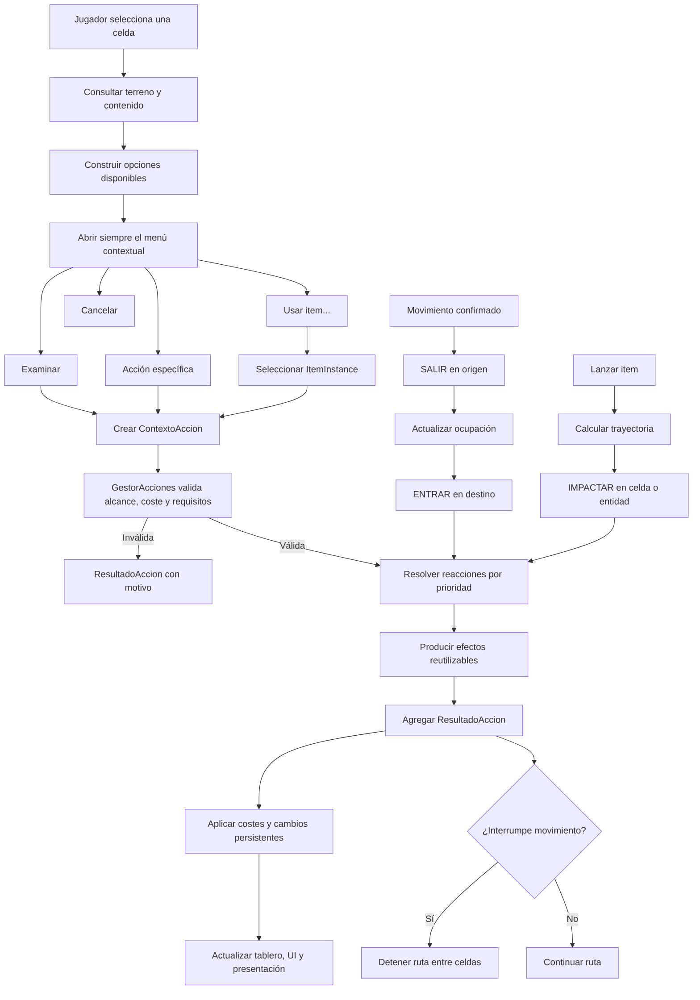

# Exhume — Roadmap del sistema de interacciones y eventos en celdas

> Registro técnico vivo para el equipo y futuras sesiones de Codex.
>
> Documento humano complementario: [Plan del sistema de interacciones (PDF)](Plan_sistema_interacciones_Exhume.pdf).

## Estado general

- Estado actual: Fase 10 — incrementos 10.1 y 10.2 implementados.
- Próximo paso: ajustar la colocación visual de las puertas y revisar el cierre de 10.2.
- Última vertical slice: una palanca real de Zona1 abre y cierra dos puertas exclusivas de mecanismo mediante IDs estables.
- Última actualización de este registro: 21 de agosto de 2026.

### Progreso por fases

- [x] Fase 0 — Contratos y vocabulario.
- [x] Fase 1 — Núcleo de acciones. *(completada el 14 de agosto de 2026)*
- [x] Fase 2 — Entidad interactuable base. *(completada el 17 de agosto de 2026)*
- [x] Fase 3 — Examinar e información progresiva. *(completada el 17 de agosto de 2026)*
- [x] Fase 4 — Menú contextual obligatorio. *(completada el 17 de agosto de 2026)*
- [x] Fase 5 — Reacciones automáticas al movimiento. *(completada el 17 de agosto de 2026)*
- [x] Fase 6 — Sistema de efectos. *(completada el 18 de agosto de 2026)*
- [x] Fase 7 — Items e inventario mínimo. *(implementada el 18 de agosto de 2026; cierre de regresión con deuda registrada)*
- [ ] Fase 8 — Usar items sobre objetivos. *(iniciada el 19 de agosto de 2026)*
- [ ] Fase 9 — Lanzamiento, trayectoria e impacto. *(iniciada el 21 de agosto de 2026)*
- [ ] Fase 10 — Relaciones y mecanismos. *(iniciada el 21 de agosto de 2026)*
- [ ] Fase 11 — Turnos y efectos persistentes.
- [ ] Fase 12 — Persistencia.
- [ ] Fase 13 — Herramientas de diseño y depuración.

Cuando una fase comience, se debe cambiar su casilla y registrar debajo de ella:

1. Fecha de inicio.
2. Responsable o sesión que trabajó en ella.
3. Decisiones tomadas.
4. Archivos modificados.
5. Pruebas realizadas.
6. Deuda técnica o trabajo pendiente.

## Objetivo del sistema

El sistema debe permitir que una celda, su terreno y las entidades que contiene reaccionen de forma coherente a acciones de distinta naturaleza. No se limitará a caminar sobre lava o activar una trampa: debe servir como base para examinar, abrir, recoger, empujar, utilizar herramientas, lanzar objetos, recibir impactos, activar mecanismos y procesar efectos temporales.

La intención es permitir combinaciones emergentes sin programar manualmente cada pareja posible de item y objetivo. Por ejemplo, la lava no debería conocer específicamente un `FrascoDeAgua`. Debería reaccionar ante una acción que aporte propiedades como `agua` y una magnitud de volumen determinada. Cualquier item futuro capaz de aportar esas propiedades podría provocar una reacción compatible.

## Decisiones ya acordadas

Estas decisiones constituyen la dirección inicial del diseño. Si se cambian, se debe documentar el motivo en este archivo.

### El menú contextual siempre aparece

Al solicitar una interacción voluntaria siempre se abre un menú, incluso si solo existe una acción posible. El menú básico debe contemplar:

- `Examinar` o `Inspeccionar`.
- Las acciones específicas disponibles.
- `Usar item…` cuando corresponda.
- `Cancelar`.

Las opciones imposibles pueden mostrarse deshabilitadas cuando conocer el requisito sea útil para el jugador. Las acciones secretas no deben mostrarse antes de ser descubiertas.

### Examinar es una acción central

Examinar permite obtener información relevante, pero no revela necesariamente todos los datos internos. La información disponible podrá depender de:

- Estado visible del objetivo.
- Iluminación y distancia.
- Atributos o habilidades del personaje.
- Herramientas disponibles.
- Conocimiento adquirido anteriormente.
- Descubrimientos realizados en inspecciones previas.

Se prevén niveles de información como `VISIBLE`, `BASICO`, `DETALLADO` y `SECRETO`.

### Definición, instancia y representación son conceptos distintos

Cada interactuable o item debe separar:

- **Definición:** datos reutilizables que indican qué es y qué capacidades tiene.
- **Instancia:** estado particular durante una partida.
- **Representación:** escena, sprite, animación, sonido y posición en el mundo.

Una puerta puede compartir una misma definición con muchas otras puertas. Cada instancia conserva si está abierta, bloqueada, dañada o examinada. La escena se ocupa de representarla y comunicar sus cambios visualmente.

### Los interactuables usarán un sistema híbrido

- Los elementos con identidad, estado o comportamiento propio serán escenas.
- Los terrenos y fenómenos masivos o estáticos continuarán representados mediante tiles.
- Podrá existir una capa invisible de marcadores para pintar posiciones rápidamente y generar escenas al cargar la zona.
- Los elementos únicos podrán colocarse directamente como escenas desde el editor.

Estructura prevista de una zona:

```text
Zona1
├── CapaSuelo
├── CapaAgua
├── CapaLava
├── CapaParedes
├── CapaDecoracion
├── Interactuables
│   ├── Puerta01
│   ├── Cofre01
│   ├── Palanca01
│   └── Trampa01
├── CapaMarcadoresInteractuables   # opcional, solo para diseño/generación
└── CapaOscuridad
```

### Las acciones y resultados deben ser estructurados

La lógica no debe depender de llamadas aisladas ni limitarse a modificar valores y ejecutar `print()`. Toda acción transportará un contexto y toda resolución devolverá un resultado que otras partes del juego puedan interpretar.

Contrato conceptual de una acción:

```text
ContextoAccion
├── tipo
├── actor
├── origen
├── celda_objetivo
├── objetivo_concreto
├── item
├── etiquetas
├── magnitudes
├── alcance
└── metadatos
```

Contrato conceptual de un resultado:

```text
ResultadoAccion
├── exitosa
├── consumio_accion
├── consumio_turno
├── interrumpe_movimiento
├── mensajes
├── efectos_aplicados
├── cambios_estado
└── recursos_consumidos
```

### Los items aportan capacidades, no excepciones específicas

Algunos ejemplos de información semántica que podrán aportar los items:

```text
Piedra
├── etiquetas: impacto, contundente, arrojable
└── peso: 3

Frasco de agua
├── etiquetas: agua, liquido, arrojable
└── volumen: 2

Antorcha
├── etiquetas: fuego, calor, luz, inflamable
└── intensidad: 1
```

El objetivo recibe estas propiedades dentro del contexto de la acción y decide si puede reaccionar.

## Integración prevista con el proyecto actual

El proyecto ya dispone de componentes importantes sobre los que se construirá el sistema:

- [`TableroGrid`](scripts/tablero_grid.gd) mantiene las celdas, ocupación, reservas, iluminación y propiedades del terreno.
- [`Celda`](scripts/celda.gd) representa el estado lógico de cada coordenada.
- [`Ficha`](scenes/ficha/ficha.gd) ejecuta movimiento paso a paso y puede interrumpir una ruta.
- [`EscenarioBase`](scenes/escenario_base/escenario_base.gd) coordina input, movimiento, tablero y visión.
- [`PathFindingManager`](scripts/pathfinding_manager.gd) calcula rutas y considera obstáculos y costes del terreno.
- [`FOVManager`](scripts/fov_manager.gd) resuelve iluminación y visibilidad.

El flujo de movimiento previsto será:

```text
Confirmar paso
→ emitir SALIR en la celda de origen
→ actualizar ocupación
→ emitir ENTRAR en la celda de destino
→ resolver terreno, efectos, interactuables y ocupantes
→ agregar resultados
→ aplicar consecuencias
→ continuar o interrumpir la ruta
```

La llegada debe confirmarse antes de resolver `ENTRAR`. Si una reacción interrumpe el movimiento, la ficha se detiene entre pasos y nunca a mitad de la animación entre dos celdas.

---

## Fase 0 — Contratos y vocabulario

### Objetivo

Definir el lenguaje común del sistema antes de introducir clases y dependencias. Esta fase evita que distintas implementaciones usen nombres incompatibles para el mismo concepto o mezclen acción, reacción, efecto y resultado.

### Trabajo previsto

- Definir qué es una acción solicitada por el jugador, una acción automática y una reacción.
- Definir qué es un efecto y cómo se diferencia de la reacción que lo produce.
- Acordar los tipos iniciales de acciones:
  - `EXAMINAR`.
  - `INTERACTUAR`.
  - `ENTRAR`.
  - `SALIR`.
  - `USAR_ITEM`.
  - `LANZAR_ITEM`.
  - `IMPACTAR`.
  - `RECOGER`.
  - `SOLTAR`.
  - `FIN_TURNO`.
- Definir un catálogo inicial de etiquetas semánticas.
- Definir cómo se representan magnitudes como peso, volumen, intensidad, temperatura o potencia.
- Definir el orden de resolución cuando una celda contiene varias reacciones.
- Acordar qué resultados consumen energía, una acción, un turno, cargas o items.
- Establecer las diferencias entre éxito, fallo, bloqueo e interrupción.
- Definir los niveles de información para Examinar.

### Entregables

- Contratos conceptuales de `ContextoAccion`, `ResultadoAccion` y `OpcionAccion`.
- Lista inicial de tipos de acción.
- Catálogo inicial de etiquetas y reglas para agregar nuevas.
- Reglas de prioridad y agregación de resultados.
- Convenciones de nombres en español o inglés para código y contenido.

### Criterio de cierre

La fase termina cuando el equipo puede describir el flujo completo de una palanca, una trampa y un item arrojado sin introducir términos contradictorios ni excepciones específicas.

### Registro de implementación

- Estado: completada el 11 de agosto de 2026.
- Responsable: sesión Codex del 11 de agosto de 2026.
- Decisiones nuevas: código y contenido en español; catálogos cerrados mediante `enum`; IDs y etiquetas extensibles mediante `StringName`; `EstadoResolucion` distingue éxito, fallo y bloqueo, mientras la interrupción es una consecuencia ortogonal; los costes se cobran una sola vez después de resolver; orden determinista por categoría, prioridad e ID estable.
- Archivos modificados: [`docs/CONTRATOS_SISTEMA_INTERACCIONES.md`](docs/CONTRATOS_SISTEMA_INTERACCIONES.md) y este roadmap.
- Pruebas: revisión conceptual completa de los flujos de palanca, trampa e item arrojado; verificación contra las convenciones actuales de `Celda`, `TableroGrid` y `EscenarioBase`.
- Pendientes: convertir los contratos conceptuales en clases de la Fase 1 y validar sus invariantes mediante pruebas ejecutables.

## Fase 1 — Núcleo de acciones

### Objetivo

Implementar el canal común por el que pasarán todas las interacciones automáticas y voluntarias.

### Trabajo previsto

- Crear `ContextoAccion` con actor, coordenadas, objetivo, item, etiquetas y magnitudes.
- Crear `ResultadoAccion` con éxito, mensajes, efectos, costes e interrupción.
- Crear `OpcionAccion` para representar cada entrada del menú sin acoplarla a la interfaz.
- Crear `GestorAcciones` como coordinador de validación y resolución.
- Añadir señales de inicio, resolución y finalización.
- Definir validaciones comunes:
  - Actor válido.
  - Objetivo válido.
  - Alcance.
  - Línea de efecto cuando corresponda.
  - Requisitos.
  - Costes disponibles.
- Permitir que una acción inválida devuelva un motivo comprensible sin producir efectos.
- Mantener el núcleo independiente de puertas, palancas, lava, inventario y UI.

### Entregables

- Clases o Resources que implementen los tres contratos principales.
- `GestorAcciones` integrado de forma mínima en una escena de prueba.
- Pruebas unitarias o escenas de prueba para éxito y fallo.
- Registro legible del ciclo de una acción durante desarrollo.

### Criterio de cierre

Una acción artificial puede enviarse a un receptor de prueba y devuelve un resultado estructurado. Los fallos incluyen motivos y no modifican estado.

### Registro de implementación

- Estado: completada el 14 de agosto de 2026; iniciada el 11 de agosto de 2026.
- Responsable: sesiones Codex del 11 y 14 de agosto de 2026.
- Decisiones nuevas: vocabulario compartido agrupado en `TiposInteraccion`; los tres contratos son `RefCounted` inmutables después de construirse y devuelven copias defensivas de sus colecciones; los resultados se crean mediante fábricas de éxito, fallo y bloqueo; un bloqueo descarta siempre efectos, cambios, costes e interrupción; las opciones se crean mediante fábricas habilitada/bloqueada y mantienen separados disponibilidad, secreto y costes previstos; los receptores cumplen por comportamiento los métodos idempotentes `validar_accion()` y `resolver_accion()`, sin imponer herencia común; `GestorAcciones` resuelve sincrónicamente, mide alcance mediante distancia Manhattan y emite inicio, resolución y finalización exactamente una vez para todo contexto existente; línea de efecto y costes se integran como servicios separados; el `validador_espacial` usa `TipoLineaEfecto` (`NINGUNA`, `VISUAL`, `FISICA`); `ValidadorEspacialTablero` implementa `VISUAL` con Bresenham compartido con FOV, bloquea obstáculos intermedios y permite un destino opaco; `FISICA` permanece explícitamente no implementada; el `proveedor_costes` valida sin mutar, consume sincrónicamente antes de emitir las señales finales y respeta `PoliticaCobro` (`SOLO_EXITO`, `AL_INTENTAR`); `accion_resuelta` expone el resultado base y `accion_finalizada` el resultado definitivo; `ProveedorCostesFicha` resuelve el actor del contexto, soporta únicamente energía entera y rechaza claves desconocidas; el registro de desarrollo observa las señales sin modificar el gestor y conserva líneas deterministas consultables además de su salida opcional a consola.
- Archivos modificados: [`scripts/interacciones/tipos_interaccion.gd`](scripts/interacciones/tipos_interaccion.gd), [`scripts/interacciones/contexto_accion.gd`](scripts/interacciones/contexto_accion.gd), [`scripts/interacciones/resultado_accion.gd`](scripts/interacciones/resultado_accion.gd), [`scripts/interacciones/opcion_accion.gd`](scripts/interacciones/opcion_accion.gd), [`scripts/interacciones/gestor_acciones.gd`](scripts/interacciones/gestor_acciones.gd), [`scripts/interacciones/validador_espacial_tablero.gd`](scripts/interacciones/validador_espacial_tablero.gd), [`scripts/interacciones/proveedor_costes_ficha.gd`](scripts/interacciones/proveedor_costes_ficha.gd), [`scripts/interacciones/debug/registro_acciones_desarrollo.gd`](scripts/interacciones/debug/registro_acciones_desarrollo.gd), [`scripts/geometria_grid.gd`](scripts/geometria_grid.gd), [`scripts/fov_manager.gd`](scripts/fov_manager.gd), [`scripts/tablero_grid.gd`](scripts/tablero_grid.gd), [`scenes/tests/EscenaPruebaAcciones.tscn`](scenes/tests/EscenaPruebaAcciones.tscn), [`scenes/tests/escena_prueba_acciones.gd`](scenes/tests/escena_prueba_acciones.gd), [`scenes/tests/objeto_examinable_prueba.gd`](scenes/tests/objeto_examinable_prueba.gd), [`assets/tile_sets/basics.tres`](assets/tile_sets/basics.tres), [`assets/tile_sets/structures/cave_columns.tres`](assets/tile_sets/structures/cave_columns.tres), [`docs/CONTRATOS_SISTEMA_INTERACCIONES.md`](docs/CONTRATOS_SISTEMA_INTERACCIONES.md) y este roadmap.
- Pruebas: reconocimiento de las clases globales durante el escaneo de Godot 4.7; [`tests/interacciones/prueba_resultado_accion.gd`](tests/interacciones/prueba_resultado_accion.gd) valida 3 casos de resultado; [`tests/interacciones/prueba_contexto_accion.gd`](tests/interacciones/prueba_contexto_accion.gd) valida 2 casos de contexto incluyendo requisitos espacial y económico; [`tests/interacciones/prueba_opcion_accion.gd`](tests/interacciones/prueba_opcion_accion.gd) valida 3 casos de opción incluyendo requisito espacial y política de cobro; [`tests/interacciones/prueba_contrato_receptor_acciones.gd`](tests/interacciones/prueba_contrato_receptor_acciones.gd) valida 2 casos del protocolo receptor; [`tests/interacciones/prueba_gestor_acciones.gd`](tests/interacciones/prueba_gestor_acciones.gd) valida 6 casos del ciclo, alcance, bloqueos, contratos y señales; [`tests/interacciones/prueba_servicio_espacial_acciones.gd`](tests/interacciones/prueba_servicio_espacial_acciones.gd) valida 4 casos del servicio espacial; [`tests/interacciones/prueba_servicio_costes_acciones.gd`](tests/interacciones/prueba_servicio_costes_acciones.gd) valida 7 casos del servicio de costes; [`tests/interacciones/prueba_proveedor_costes_ficha.gd`](tests/interacciones/prueba_proveedor_costes_ficha.gd) valida 5 casos de actor, claves, unidades, insuficiencia y cobro real; [`tests/interacciones/prueba_validador_espacial_tablero.gd`](tests/interacciones/prueba_validador_espacial_tablero.gd) valida 7 casos de geometría, tablero, obstáculos, extremos, modo físico e integración; [`tests/interacciones/prueba_registro_acciones_desarrollo.gd`](tests/interacciones/prueba_registro_acciones_desarrollo.gd) valida el formato de las tres etapas, el coste final, la desconexión y la limpieza; [`tests/interacciones/prueba_escena_acciones.gd`](tests/interacciones/prueba_escena_acciones.gd) valida la misma escena ejecutable mediante su modo automático de integración; [`tests/tablero/prueba_columnas_bloquean_vision.gd`](tests/tablero/prueba_columnas_bloquean_vision.gd) valida las dos variantes del TileSet y las columnas colocadas en `Zona1`; la escena técnica completó `EXAMINAR` con línea visual real, registro de las tres etapas, coste de energía `200 → 199` y cambio `fue_examinado: false → true`; en uso manual la escena espera `Espacio`/`Enter`, permite reiniciar con `R` y presenta el estado en pantalla; carga breve de la escena principal y de la escena técnica sin errores de GDScript; batería ejecutada correctamente con Godot 4.7; comprobación de formato mediante `git diff --check`.
- Cierre: la escena técnica ejecuta desde `F6` un éxito mediante `Espacio`/`Enter` y un bloqueo determinista mediante `B`; el bloqueo devuelve `costes_insuficientes`, conserva energía `200 → 200`, mantiene `fue_examinado: false → false` y registra costes `{}`. La prueba automatizada reproduce ambos casos.
- Pendientes/deuda no bloqueante: definir un proveedor compuesto cuando existan costes de turno, cargas o items; definir la línea `FISICA` cuando existan propiedades de obstáculos y alturas.

## Fase 2 — Entidad interactuable base

### Objetivo

Representar objetos del mundo con identidad, definición reutilizable, coordenada y estado persistente.

### Trabajo previsto

- Crear una clase base `Interactuable`.
- Crear `InteractuableDefinition` como Resource reutilizable.
- Asignar un ID estable a cada instancia persistente.
- Registrar y desregistrar interactuables en `TableroGrid`.
- Ampliar `Celda` para distinguir claramente:
  - Ocupantes.
  - Reservas.
  - Interactuables.
  - Items en el suelo.
  - Efectos de superficie.
  - Iluminación.
- Crear un nodo `Interactuables` dentro de las zonas.
- Definir el ciclo de vida al cargar, mover o destruir una entidad.
- Permitir que un interactuable publique opciones sin conocer el menú que las mostrará.
- Preparar componentes de reacción modulares, evitando una clase base gigantesca.

### Entregables

- Clase y definición base.
- Registro espacial desde el tablero.
- Fuente de luz interactuable colocable desde el editor.
- Validación de IDs duplicados al menos durante desarrollo.

### Criterio de cierre

Una antorcha o fogata colocada como escena aparece en la celda correcta, publica `Apagar` o `Encender`, conserva su estado y actualiza su aporte de iluminación sin lógica específica de contenido en `EscenarioBase`.

### Registro de implementación

- Estado: completada el 17 de agosto de 2026.
- Responsable: sesión Codex del 17 de agosto de 2026.
- Decisiones nuevas: la primera vertical slice cambia de palanca a fuente de luz interactuable; el código mantiene nombres en español mediante `DefinicionInteractuable` y `DefinicionFuenteLuz`; la configuración reutilizable se guarda en `Resource` tipados y el estado `encendida` pertenece a cada instancia; antorchas y fogatas dejan de ser tiles y pasan a escenas con ID estable; una misma escena se registra en las categorías `interactuables` e `iluminacion` de su celda; la oclusión lógica sigue siendo responsabilidad de `FOVManager`, mientras la definición conserva la región visual y la máscara de fog propia; las posiciones migradas se obtienen mediante `TileMapLayer.map_to_local()` para respetar el layout isométrico de Godot; el registro devuelve motivos estables y rechaza IDs duplicados sin sustituir ni registrar parcialmente la segunda instancia; los interactuables de esta entrega son estáticos y su movimiento entre celdas queda fuera del alcance actual.
- Archivos modificados: [`scripts/interacciones/interactuables/definicion_interactuable.gd`](scripts/interacciones/interactuables/definicion_interactuable.gd), [`scripts/interacciones/interactuables/interactuable.gd`](scripts/interacciones/interactuables/interactuable.gd), [`scripts/interacciones/interactuables/fuentes_luz/definicion_fuente_luz.gd`](scripts/interacciones/interactuables/fuentes_luz/definicion_fuente_luz.gd), [`scripts/interacciones/interactuables/fuentes_luz/fuente_luz_interactuable.gd`](scripts/interacciones/interactuables/fuentes_luz/fuente_luz_interactuable.gd), [`scenes/interactuables/fuentes_luz/fuente_luz_interactuable.tscn`](scenes/interactuables/fuentes_luz/fuente_luz_interactuable.tscn), definiciones bajo [`assets/interactuables/luces`](assets/interactuables/luces), [`scripts/celda.gd`](scripts/celda.gd), [`scripts/tablero_grid.gd`](scripts/tablero_grid.gd), [`scripts/fov_manager.gd`](scripts/fov_manager.gd), [`scenes/Zona1/zona_1.tscn`](scenes/Zona1/zona_1.tscn), [`scenes/escenario_base/escenario_base.gd`](scenes/escenario_base/escenario_base.gd), [`tests/interacciones/prueba_fuentes_luz_interactuables.gd`](tests/interacciones/prueba_fuentes_luz_interactuables.gd) y este roadmap.
- Pruebas: las once luces pintadas en `CapaLuces` se conservan como escenas en sus coordenadas; una antorcha se registra simultáneamente como interactuable y fuente de luz; conserva radios, oclusión, anclaje isométrico y máscara de fog desde su definición; `Apagar` cambia estado, sprite y próxima opción a `Encender`; una pared iluminada queda visible y la celda posterior permanece en sombra; la comprobación manual confirmó alineación y estados visuales; un segundo interactuable con el mismo ID devuelve `id_instancia_duplicado`, se rechaza y no modifica el índice, la celda ni la instancia original; escena principal cargada sin errores; batería existente de trece scripts de prueba completada.
- Pendientes/deuda no bloqueante: evaluar a futuro si el diseño necesita mover interactuables entre celdas; completar el desregistro automático y la restauración de propiedades de celda cuando existan entidades destruibles. La conexión de opciones al menú quedó resuelta en la Fase 4.

## Fase 3 — Examinar e información progresiva

### Objetivo

Implementar Examinar como un mecanismo general para obtener y recordar información del mundo.

### Trabajo previsto

- Crear la acción `EXAMINAR`.
- Permitir examinar terreno, interactuables, items y ocupantes.
- Separar descripción visible, información básica, detalle mecánico y secretos.
- Definir qué información se recuerda después de descubrirla.
- Evaluar condiciones como iluminación, distancia, percepción y herramientas.
- Permitir que una inspección falle, sea parcial o revele información nueva.
- Evitar que la descripción exponga directamente variables internas o contenido destinado al diseñador.
- Preparar mensajes localizables o identificadores de texto para el futuro.

### Entregables

- Componente o proveedor común de información examinable.
- Estructura de datos para información descubierta.
- Presentación inicial del resultado en UI.
- Caso de prueba con una placa aparentemente normal que puede descubrirse como mecanismo.

### Criterio de cierre

Examinar el mismo objetivo en condiciones distintas produce información coherente y los descubrimientos relevantes permanecen registrados.

### Registro de implementación

- Estado: completada el 17 de agosto de 2026; incrementos 3.1 a 3.5 completados.
- Responsable: sesión Codex del 17 de agosto de 2026.
- Decisiones nuevas: el conocimiento pertenecerá a cada observador y se registrará por ID estable de instancia y fragmento; `FragmentoInformacion` representa contenido narrativo reutilizable mediante ID, nivel, mensaje, pistas semánticas y recordabilidad; los secretos exigen al menos una pista explícita; `CondicionesObservacion` transporta de forma inmutable observador, distancia, visibilidad actual, línea visual y pistas sin mezclar conocimiento ni UI; para la primera fuente de luz se prevé examen básico hasta cinco celdas y detallado solo en adyacencia, con alcances independientes del radio mecánico de iluminación; una celda solo explorada no permite descubrimientos nuevos; los perfiles de observación de enemigos quedan diferidos.
- Archivos modificados en 3.1: [`scripts/interacciones/examen/fragmento_informacion.gd`](scripts/interacciones/examen/fragmento_informacion.gd), [`scripts/interacciones/examen/condiciones_observacion.gd`](scripts/interacciones/examen/condiciones_observacion.gd), [`scripts/interacciones/interactuables/definicion_interactuable.gd`](scripts/interacciones/interactuables/definicion_interactuable.gd), [`tests/interacciones/prueba_contratos_examen.gd`](tests/interacciones/prueba_contratos_examen.gd), [`docs/CONTRATOS_SISTEMA_INTERACCIONES.md`](docs/CONTRATOS_SISTEMA_INTERACCIONES.md) y este roadmap.
- Pruebas de 3.1: `prueba_contratos_examen.gd` valida los contratos de fragmentos, condiciones y, tras 3.4, solicitud de examen; cubre identidad, mensajes, recordabilidad, pistas, duplicados, copias defensivas, observaciones inválidas e IDs únicos; `prueba_contexto_accion.gd` y `prueba_fuentes_luz_interactuables.gd` continúan correctas con Godot 4.7.
- Incremento 3.2: `PerfilObservacion` declara alcances básico, detallado y secreto sin acoplarlos al radio de iluminación; `EvaluadorInformacion` filtra fragmentos de forma pura según el perfil, las condiciones actuales y todas las pistas requeridas; `ResultadoEvaluacionInformacion` distingue bloqueos de evaluaciones válidas y señala si la distancia permite detalle; cada definición puede asociar opcionalmente un perfil válido.
- Archivos modificados en 3.2: [`scripts/interacciones/examen/perfil_observacion.gd`](scripts/interacciones/examen/perfil_observacion.gd), [`scripts/interacciones/examen/evaluador_informacion.gd`](scripts/interacciones/examen/evaluador_informacion.gd), [`scripts/interacciones/examen/resultado_evaluacion_informacion.gd`](scripts/interacciones/examen/resultado_evaluacion_informacion.gd), [`scripts/interacciones/interactuables/definicion_interactuable.gd`](scripts/interacciones/interactuables/definicion_interactuable.gd), [`tests/interacciones/prueba_evaluador_informacion.gd`](tests/interacciones/prueba_evaluador_informacion.gd), [`docs/CONTRATOS_SISTEMA_INTERACCIONES.md`](docs/CONTRATOS_SISTEMA_INTERACCIONES.md) y este roadmap.
- Pruebas de 3.2: `prueba_evaluador_informacion.gd` valida cinco grupos de casos: alcance básico inclusivo de cinco celdas, detalle adyacente, secreto que exige cercanía y pista, bloqueos por visibilidad, línea y distancia, perfiles inválidos, duplicados y copias defensivas; continúan correctas `prueba_contratos_examen.gd`, `prueba_contexto_accion.gd` y `prueba_fuentes_luz_interactuables.gd` con Godot 4.7.
- Incremento 3.3: `RegistroConocimiento` conserva en memoria únicamente IDs estables bajo la jerarquía observador, instancia objetivo y fragmento; el registro es atómico e idempotente, ignora fragmentos transitorios y mantiene separados observadores y objetivos; `ResultadoRegistroConocimiento` distingue errores de registros válidos sin novedades; no se implementan todavía serialización, importación ni borrado de conocimiento.
- Archivos modificados en 3.3: [`scripts/interacciones/examen/registro_conocimiento.gd`](scripts/interacciones/examen/registro_conocimiento.gd), [`scripts/interacciones/examen/resultado_registro_conocimiento.gd`](scripts/interacciones/examen/resultado_registro_conocimiento.gd), [`tests/interacciones/prueba_registro_conocimiento.gd`](tests/interacciones/prueba_registro_conocimiento.gd), [`docs/CONTRATOS_SISTEMA_INTERACCIONES.md`](docs/CONTRATOS_SISTEMA_INTERACCIONES.md) y este roadmap.
- Pruebas de 3.3: `prueba_registro_conocimiento.gd` valida cinco grupos de casos sobre recordabilidad, idempotencia, separación entre observadores, separación entre instancias, rechazo atómico, duplicados y copias defensivas; continúan correctas `prueba_contratos_examen.gd`, `prueba_evaluador_informacion.gd` y `prueba_fuentes_luz_interactuables.gd` con Godot 4.7.
- Incremento 3.4: `SolicitudExamen` incorpora ID de observador y pistas como datos tipados de `ContextoAccion`; el actor debe acreditar el mismo ID mediante `obtener_id_observador()`; `ServicioExamen` calcula condiciones desde el tablero, evalúa, registra conocimiento y produce un `ResultadoAccion`; `Interactuable` publica y resuelve `EXAMINAR` mediante el servicio común; la antorcha de pie real contiene fragmentos básico, detallado y secreto, y selecciona una variante básica encendida/apagada sin guardar el valor actual de ese estado; `TableroGrid` inyecta el servicio y `EscenarioBase` deja configurados gestor, registro y validador sin alterar todavía los clics o la UI.
- Archivos modificados en 3.4: [`scripts/interacciones/examen/solicitud_examen.gd`](scripts/interacciones/examen/solicitud_examen.gd), [`scripts/interacciones/examen/servicio_examen.gd`](scripts/interacciones/examen/servicio_examen.gd), [`scripts/interacciones/contexto_accion.gd`](scripts/interacciones/contexto_accion.gd), [`scripts/interacciones/interactuables/interactuable.gd`](scripts/interacciones/interactuables/interactuable.gd), [`scripts/interacciones/interactuables/fuentes_luz/definicion_fuente_luz.gd`](scripts/interacciones/interactuables/fuentes_luz/definicion_fuente_luz.gd), [`scripts/interacciones/interactuables/fuentes_luz/fuente_luz_interactuable.gd`](scripts/interacciones/interactuables/fuentes_luz/fuente_luz_interactuable.gd), [`assets/interactuables/luces/antorcha_pie.tres`](assets/interactuables/luces/antorcha_pie.tres), [`scripts/tablero_grid.gd`](scripts/tablero_grid.gd), [`scenes/ficha/ficha.gd`](scenes/ficha/ficha.gd), [`scenes/escenario_base/escenario_base.gd`](scenes/escenario_base/escenario_base.gd), [`tests/interacciones/prueba_integracion_examinar_fuente_luz.gd`](tests/interacciones/prueba_integracion_examinar_fuente_luz.gd), pruebas ajustadas, contratos y este roadmap.
- Pruebas de 3.4: la prueba integral usa la antorcha `zona1_antorcha_pie_02_01` y recorre `GestorAcciones`, validación visual, interactuable, servicio, evaluador, registro y resultado; valida publicación de opciones, un único mensaje básico a cinco celdas, descubrimiento profundo, repetición idempotente, secreto con pista, variante apagada y bloqueo al quedar solo explorada; pasan además contexto, gestor, contratos de examen, evaluador, registro, fuentes de luz y una carga breve de la escena principal con Godot 4.7.
- Corrección adicional: `RegistroConocimiento` ordena IDs comparando su representación textual, evitando depender del orden interno de `StringName` entre recursos cargados y objetos creados en memoria.
- Incremento 3.5: `CatalogoMensajesInteraccion` resuelve IDs narrativos desde un `Resource` reemplazable; `PanelResultadoAccion` presenta éxitos y bloqueos, permite cierre mediante botón o `ui_cancel` y expone parámetros y señales para personalización posterior; `EscenarioBase` añade la activación temporal con `E` sobre la celda bajo el cursor y entrega al panel el resultado real de `GestorAcciones`, sin introducir UI dentro del interactuable.
- Archivos modificados en 3.5: [`scripts/interacciones/presentacion/catalogo_mensajes_interaccion.gd`](scripts/interacciones/presentacion/catalogo_mensajes_interaccion.gd), [`assets/interactuables/mensajes_interacciones.tres`](assets/interactuables/mensajes_interacciones.tres), [`scenes/ui/interacciones/panel_resultado_accion.gd`](scenes/ui/interacciones/panel_resultado_accion.gd), [`scenes/ui/interacciones/panel_resultado_accion.tscn`](scenes/ui/interacciones/panel_resultado_accion.tscn), [`scenes/escenario_base/escenario_base.gd`](scenes/escenario_base/escenario_base.gd), [`scenes/escenario_base/escenario_base.tscn`](scenes/escenario_base/escenario_base.tscn), [`tests/interacciones/prueba_presentacion_examen.gd`](tests/interacciones/prueba_presentacion_examen.gd), contratos y este roadmap.
- Pruebas de 3.5: `prueba_presentacion_examen.gd` valida catálogo y respaldo, composición ordenada, presentación de bloqueo, señales, botón de cierre y activación real desde la escena principal; pasan además contexto, contratos, evaluador, registro, integración de la antorcha, fuentes de luz y una carga breve de la escena principal con Godot 4.7.
- Cierre: la antorcha real produce información básica, detallada y secreta según condiciones; el conocimiento recordable permanece por observador e instancia; repetir el examen no duplica descubrimientos; los resultados se presentan fuera del interactuable.
- Ajuste posterior al cierre: `VISIBLE` se reserva como regla general para reconocimiento pasivo; cuando estado evidente e identidad se solapan, el contenido debe integrarlos en un único fragmento `BASICO`. La antorcha pasa a mostrar una sola frase básica a distancia, con variantes encendida y apagada.
- Pendientes/deuda no bloqueante: diseñar el estilo definitivo mediante tema o sustitución de la escena del panel; migrar el catálogo provisional al sistema de localización futuro. El atajo `E` y la selección automática del primer objetivo se retiraron al cerrar la Fase 4.

## Fase 4 — Menú contextual obligatorio

### Objetivo

Convertir toda interacción voluntaria en una elección explícita y extensible.

### Flujo previsto

```text
Seleccionar celda
→ consultar objetivos perceptibles
→ elegir objetivo si existen varios
→ construir OpcionAccion[]
→ abrir siempre el menú
→ seleccionar Examinar / acción / Usar item / Cancelar
→ validar
→ resolver
→ presentar ResultadoAccion
```

### Trabajo previsto

- Diseñar un menú que siempre aparezca.
- Mantener `Examinar` como opción habitual.
- Mostrar acciones habilitadas y, cuando sea útil, acciones deshabilitadas con explicación.
- Resolver la presencia de varios objetivos en la misma celda.
- Incluir `Usar item…` sin implementar aún el inventario completo.
- Permitir cancelar sin coste.
- Bloquear input de movimiento mientras el menú esté abierto.
- Preparar navegación con ratón, teclado y gamepad.
- Evitar que cada interactuable cree o modifique controles de UI.

### Entregables

- Componente reutilizable de menú contextual.
- Adaptador entre `OpcionAccion` y la interfaz.
- Flujo completo para la fuente de luz de prueba.
- Mensajes claros para acciones bloqueadas.

### Criterio de cierre

Interactuar con una fuente de luz siempre abre un menú con `Examinar`, `Encender` o `Apagar`, y `Cancelar`; todas las opciones producen resultados coherentes y el menú no conoce la implementación de la fuente.

### Registro de implementación

- Estado: completada el 17 de agosto de 2026.
- Responsable: sesión Codex del 17 de agosto de 2026.
- Decisiones nuevas: el clic izquierdo sustituirá el panel técnico de detalles y solicitará la interacción contextual; los objetivos perceptibles requieren una celda actualmente `VISIBLE`, un ID de instancia válido y al menos una opción publicada; se ordenan por ID estable; un único objetivo puede seleccionarse directamente, mientras varios quedan pendientes de una elección explícita y nunca se elige automáticamente el primero; actualizar el hover no reemplaza una selección confirmada; `Encender` y `Apagar` requerirán adyacencia; el panel de resultados continuará siendo modal durante esta fase; el outline blanco se genera por código mediante un shader en memoria, reutiliza la textura y región del `Sprite2D` y no requiere imágenes auxiliares ensanchadas; el menú y el selector de objetivos comparten una vista genérica basada en `EntradaMenuContextual`; `Cancelar` es una entrada exclusiva de UI; las opciones secretas se omiten antes de crear controles; elegir una opción en 4.3 solo emite su `OpcionAccion` y no resuelve ni modifica el mundo; la navegación de 4.4 consume las acciones abstractas `ui_up`, `ui_down`, `ui_accept` y `ui_cancel`, compartidas por teclado y gamepad; un único estado modal del escenario bloquea órdenes de movimiento, hover accionable y trayectorias mientras el menú o el panel de resultados están abiertos, y solo emite cambios al activarse o restaurarse realmente.
- Archivos modificados en 4.1–4.4: [`scripts/interacciones/seleccion/selector_objetivos_interaccion.gd`](scripts/interacciones/seleccion/selector_objetivos_interaccion.gd), [`scripts/interacciones/seleccion/estado_seleccion_objetivos.gd`](scripts/interacciones/seleccion/estado_seleccion_objetivos.gd), [`scripts/interacciones/presentacion/resaltador_outline_2d.gd`](scripts/interacciones/presentacion/resaltador_outline_2d.gd), [`scripts/interacciones/presentacion/entrada_menu_contextual.gd`](scripts/interacciones/presentacion/entrada_menu_contextual.gd), [`scripts/interacciones/presentacion/adaptador_menu_contextual.gd`](scripts/interacciones/presentacion/adaptador_menu_contextual.gd), [`scripts/interacciones/interactuables/interactuable.gd`](scripts/interacciones/interactuables/interactuable.gd), [`scenes/ui/interacciones/menu_contextual_interacciones.gd`](scenes/ui/interacciones/menu_contextual_interacciones.gd), [`scenes/ui/interacciones/menu_contextual_interacciones.tscn`](scenes/ui/interacciones/menu_contextual_interacciones.tscn), [`scenes/escenario_base/escenario_base.gd`](scenes/escenario_base/escenario_base.gd), [`scenes/escenario_base/escenario_base.tscn`](scenes/escenario_base/escenario_base.tscn), [`assets/interactuables/mensajes_interacciones.tres`](assets/interactuables/mensajes_interacciones.tres), [`tests/interacciones/prueba_selector_objetivos_interaccion.gd`](tests/interacciones/prueba_selector_objetivos_interaccion.gd), [`tests/interacciones/prueba_resaltado_interactuables.gd`](tests/interacciones/prueba_resaltado_interactuables.gd), [`tests/interacciones/prueba_menu_contextual_interacciones.gd`](tests/interacciones/prueba_menu_contextual_interacciones.gd), [`tests/interacciones/prueba_integracion_menu_contextual.gd`](tests/interacciones/prueba_integracion_menu_contextual.gd) y este roadmap.
- Pruebas de 4.1–4.4: percepción por visibilidad; filtrado y orden estable de objetivos; selección directa y múltiple; outline programático; orden de opciones por prioridad e ID; omisión de secretos; presentación de bloqueos con motivo; `Cancelar` separado de `OpcionAccion`; menú obligatorio para la antorcha; emisión sin ejecución; conservación del estado mecánico; selector visual de varios objetivos; foco inicial; navegación envolvente que omite opciones deshabilitadas; aceptación de la opción enfocada; cancelación mediante acción abstracta; bloqueo de clic derecho y movimiento; limpieza de trayectoria; estado modal del panel de resultados; activación y restauración modal exactamente una vez.
- Incremento 4.5: `ConstructorContextoAccion` verifica el protocolo del proveedor y la coherencia entre opción y contexto antes de entregar exactamente un contexto a `GestorAcciones`; `Interactuable` construye `EXAMINAR` con su perfil y `SolicitudExamen`, o `INTERACTUAR` con el ID específico; la fuente de luz declara alcance Manhattan `1.0` para `encender` y `apagar`; la UI no interpreta esas reglas; el gestor revalida inmediatamente antes de resolver y un bloqueo no modifica el objetivo.
- Archivos añadidos o ampliados en 4.5: [`scripts/interacciones/constructor_contexto_accion.gd`](scripts/interacciones/constructor_contexto_accion.gd), [`scripts/interacciones/interactuables/interactuable.gd`](scripts/interacciones/interactuables/interactuable.gd), [`scripts/interacciones/interactuables/fuentes_luz/fuente_luz_interactuable.gd`](scripts/interacciones/interactuables/fuentes_luz/fuente_luz_interactuable.gd), [`scenes/escenario_base/escenario_base.gd`](scenes/escenario_base/escenario_base.gd), [`tests/interacciones/prueba_constructor_contexto_accion.gd`](tests/interacciones/prueba_constructor_contexto_accion.gd), [`tests/interacciones/prueba_integracion_menu_contextual.gd`](tests/interacciones/prueba_integracion_menu_contextual.gd), [`docs/CONTRATOS_SISTEMA_INTERACCIONES.md`](docs/CONTRATOS_SISTEMA_INTERACCIONES.md) y el catálogo de mensajes.
- Pruebas de 4.5: construcción coherente de `EXAMINAR` e `INTERACTUAR`; solicitud tipada de examen; adyacencia de `Encender/Apagar`; ejecución exitosa mediante `GestorAcciones`; cambio real de estado; examen con información; revalidación y bloqueo `fuera_de_alcance`; ausencia de mutación al bloquear; cierre del menú y restauración modal tras finalizar.
- Incremento 4.6: todo resultado del menú se presenta mediante `PanelResultadoAccion`; la transición menú → resultado no libera el estado modal; selección y outline se conservan hasta cerrar el panel; la siguiente apertura reconstruye las opciones desde el estado confirmado; fogata y ambas antorchas de pared incorporan perfil y fragmento básico con variantes encendida/apagada, sin trasladar contenido narrativo a la UI.
- Ajuste posterior de presentación: el menú conserva un margen programable respecto de los cuatro bordes del viewport; su posición se corrige después de calcular el tamaño dinámico de las opciones y vuelve a ajustarse si cambia el tamaño de la ventana.
- Archivos añadidos o ampliados en 4.6: [`scenes/escenario_base/escenario_base.gd`](scenes/escenario_base/escenario_base.gd), las cuatro definiciones bajo [`assets/interactuables/luces`](assets/interactuables/luces), [`assets/interactuables/mensajes_interacciones.tres`](assets/interactuables/mensajes_interacciones.tres), [`tests/interacciones/prueba_integracion_menu_contextual.gd`](tests/interacciones/prueba_integracion_menu_contextual.gd), [`docs/CONTRATOS_SISTEMA_INTERACCIONES.md`](docs/CONTRATOS_SISTEMA_INTERACCIONES.md) y este roadmap.
- Pruebas de 4.6: presentación de éxito, examen y bloqueo; título y mensajes traducidos; continuidad modal; persistencia del resaltado durante el resultado; restauración al cerrar; reconstrucción `Encender/Apagar`; examen desde menú para antorcha de pie, fogata y ambas definiciones de pared; variantes narrativas según estado.
- Incremento 4.7: se retiraron la captura directa de `KEY_E` y los helpers que elegían automáticamente el primer objetivo examinable; el clic izquierdo y el menú obligatorio quedan como única entrada voluntaria al flujo contextual; se eliminó `PanelDetalle` y sus referencias, porque `PanelResultadoAccion` lo reemplaza; la regresión verifica que `E` no abre UI, no ejecuta acciones y no registra conocimiento.
- Archivos ampliados o depurados en 4.7: [`scenes/escenario_base/escenario_base.gd`](scenes/escenario_base/escenario_base.gd), [`scenes/escenario_base/escenario_base.tscn`](scenes/escenario_base/escenario_base.tscn), [`tests/interacciones/prueba_presentacion_examen.gd`](tests/interacciones/prueba_presentacion_examen.gd), [`docs/CONTRATOS_SISTEMA_INTERACCIONES.md`](docs/CONTRATOS_SISTEMA_INTERACCIONES.md) y este roadmap.
- Pruebas de cierre 4.7: batería secuencial de los 23 scripts bajo `tests/` completada sin fallos; integración del menú contextual y examen de las cuatro fuentes de luz correctas; regresión del retiro de `E` y `PanelDetalle` correcta; carga del editor headless, escaneo de clases globales y `git diff --check` sin errores.
- Pendientes/deuda no bloqueante: estilo visual definitivo y migración futura del catálogo al sistema de localización; no bloquean el flujo funcional cerrado en esta fase.

## Fase 5 — Reacciones automáticas al movimiento

### Objetivo

Integrar las acciones `ENTRAR` y `SALIR` con el movimiento celda por celda que ya existe.

### Trabajo previsto

- Emitir `SALIR` después de completar el paso desde el origen.
- Confirmar la ocupación del destino antes de emitir `ENTRAR`.
- Consultar terreno, efectos de superficie, interactuables y ocupantes.
- Definir prioridades de reacción.
- Agregar todos los resultados antes de decidir si continúa la ruta.
- Interrumpir el recorrido ante daño crítico, inmovilización, trampa o encuentro.
- Evitar que una reacción se ejecute dos veces por el mismo paso.
- Resolver correctamente una ruta que queda obsoleta.
- Mantener separado el consumo normal de movimiento de los costes adicionales del terreno.

### Primeros casos de contenido

- Lava que produce daño al entrar.
- Terreno difícil que consume energía adicional.
- Placa de presión que reacciona al peso.
- Trampa que aplica efectos e interrumpe la ruta.

### Criterio de cierre

La ficha camina sobre una trampa, completa el paso, activa cada trampa exactamente una vez, aplica sus consecuencias y se detiene correctamente en la celda.

### Registro de implementación

- Estado: completada el 17 de agosto de 2026; incrementos 5.1 a 5.6 implementados.
- Responsable: sesión Codex del 17 de agosto de 2026.
- Incremento 5.1: `Ficha` expone dos callbacks síncronos por paso. `SALIR` se
  procesa después de completar el tween y antes de confirmar la ocupación;
  `ENTRAR` se procesa después de que tablero, coordenada de la ficha y coste
  normal del paso estén confirmados. Una interrupción solicitada en cualquiera
  de ambos puntos se aplica antes del siguiente tween, incluso en el último
  tramo de la ruta.
- Decisiones nuevas: el coste normal continúa perteneciendo a `Ficha`; los
  callbacks de 5.1 no crean menú ni presentan UI; las señales de ocupación del
  tablero siguen siendo observacionales y no disparan reacciones. En 5.2 cada
  fuente automática acredita ID y prioridad mediante un protocolo de comportamiento;
  la consulta usa copias, excluye al actor entre ocupantes y ordena por categoría,
  prioridad e ID estable.
- Incremento 5.2: `ConsultorReaccionesCelda` consulta terreno, efectos de
  superficie, interactuables, items y ocupantes sin resolverlos. `ReaccionCelda`
  conserva el descriptor ordenable y `CategoriaReaccion` fija el orden acordado.
  La prueba usa humo venenoso como superficie consultable, sin aplicar todavía
  veneno, daño ni estados.
- Incremento 5.3: cada descriptor se convierte en un contexto automático dirigido
  y se procesa mediante `GestorAcciones`; `ResultadoReacciones` agrega mensajes,
  efectos confirmados, cambios, costes e interrupción. Un receptor duplicado se
  ejecuta una sola vez y un resultado terminal conserva lo ya resuelto y omite los
  receptores posteriores. `EscenarioBase` conecta este flujo a `SALIR` y `ENTRAR`
  sin menú ni presentación directa.
- Incremento 5.3.1: `Zona1` incorpora el grupo organizativo `EfectosSuperficie` y
  una instancia `HumoVeneno` en la celda `(0, 0)`. El tablero descubre y registra
  superficies por ID estable; el humo publica una reacción `ENTRAR` que devuelve
  mensaje e interrupción sin aplicar todavía daño o estado de veneno. Su escena
  deja un `Sprite2D` vacío, al nivel visual de la celda, preparado para asignar el
  atlas creado por arte.
- Incremento 5.4: cada celda calcula un coste de paso compuesto por base `1`,
  adicional del terreno y aportes de superficies. `Ficha` valida el total antes
  de reservar, lo cobra únicamente tras confirmar la ocupación y duplica la
  duración del tween cuando el coste supera `1`. El pathfinding recalcula esos
  costes para el actor y suma por separado una penalización de peligro que no
  consume energía. El humo aporta `1` adicional; entrar cuesta `2`, camina a media
  velocidad y conserva su interrupción posterior a `ENTRAR`.
- Incremento 5.5: `TrampaSuperficie` es un interactuable automático que no
  publica opciones contextuales. Al recibir `ENTRAR`, despliega
  una escena de superficie configurable en un radio Manhattan sobre celdas
  caminables, registra cada instancia con ID estable e interrumpe la ruta después
  de confirmar el paso. Su presentación puede ser oculta, un indicio con opacidad
  reducida o completamente visible. La primera trampa de Zona1 está en `(4, 3)`,
  tiene radio `1` y genera humo venenoso en cinco celdas despejadas. Su atlas usa
  una columna armada y otra presionada; el indicio se presenta con alpha `0.7` y
  el modo oculto con alpha `0.0`. Las trampas cardinalmente adyacentes se agregan
  a la misma resolución automática, propagando la cadena sin duplicados ni ciclos;
  las diagonales no se encadenan.
- Incremento 5.6: las trampas quedan formalmente limitadas a un solo uso mientras
  no exista expiración de superficies ni rearme. Zona1 incorpora una segunda
  trampa en `(5, 3)`, adyacente a la de `(4, 3)`, para comprobar visualmente la
  cadena real; ambas cambian a la región presionada y despliegan su propio humo.
- Archivos modificados: [`scenes/ficha/ficha.gd`](scenes/ficha/ficha.gd),
  [`scenes/escenario_base/escenario_base.gd`](scenes/escenario_base/escenario_base.gd),
  [`scripts/celda.gd`](scripts/celda.gd),
  [`scripts/tablero_grid.gd`](scripts/tablero_grid.gd),
  [`scripts/pathfinding_manager.gd`](scripts/pathfinding_manager.gd),
  [`assets/tile_sets/terrain/cave_terrain.tres`](assets/tile_sets/terrain/cave_terrain.tres),
  [`scripts/interacciones/tipos_interaccion.gd`](scripts/interacciones/tipos_interaccion.gd),
  [`scripts/interacciones/reacciones/reaccion_celda.gd`](scripts/interacciones/reacciones/reaccion_celda.gd),
  [`scripts/interacciones/reacciones/consultor_reacciones_celda.gd`](scripts/interacciones/reacciones/consultor_reacciones_celda.gd),
  [`scripts/interacciones/reacciones/resultado_reacciones.gd`](scripts/interacciones/reacciones/resultado_reacciones.gd),
  [`scripts/interacciones/reacciones/resolver_reacciones_celda.gd`](scripts/interacciones/reacciones/resolver_reacciones_celda.gd),
  [`scripts/interacciones/reacciones/efectos_superficie/humo_veneno.gd`](scripts/interacciones/reacciones/efectos_superficie/humo_veneno.gd),
  [`scenes/efectos_superficie/HumoVeneno.tscn`](scenes/efectos_superficie/HumoVeneno.tscn),
  [`scripts/interacciones/interactuables/trampas/trampa_superficie.gd`](scripts/interacciones/interactuables/trampas/trampa_superficie.gd),
  [`scenes/interactuables/trampas/TrampaSuperficie.tscn`](scenes/interactuables/trampas/TrampaSuperficie.tscn),
  [`scenes/Zona1/zona_1.tscn`](scenes/Zona1/zona_1.tscn),
  [`scripts/interacciones/interactuables/interactuable.gd`](scripts/interacciones/interactuables/interactuable.gd),
  [`tests/movimiento/prueba_ciclo_seguro_paso.gd`](tests/movimiento/prueba_ciclo_seguro_paso.gd),
  [`tests/movimiento/prueba_costes_movimiento.gd`](tests/movimiento/prueba_costes_movimiento.gd),
  [`tests/interacciones/prueba_consultor_reacciones_celda.gd`](tests/interacciones/prueba_consultor_reacciones_celda.gd),
  [`tests/interacciones/prueba_resolver_reacciones_celda.gd`](tests/interacciones/prueba_resolver_reacciones_celda.gd),
  [`tests/interacciones/prueba_humo_veneno_superficie.gd`](tests/interacciones/prueba_humo_veneno_superficie.gd),
  [`tests/interacciones/prueba_trampa_superficie.gd`](tests/interacciones/prueba_trampa_superficie.gd),
  [`docs/CONTRATOS_SISTEMA_INTERACCIONES.md`](docs/CONTRATOS_SISTEMA_INTERACCIONES.md)
  y este roadmap.
- Pruebas: `prueba_ciclo_seguro_paso.gd` caracteriza el orden único
  `SALIR → confirmar → ENTRAR`, los estados de ocupación y coordenada observados
  en cada punto, el coste normal único y la interrupción entre pasos;
  `prueba_consultor_reacciones_celda.gd` cubre categorías, prioridad, desempate
  estable, filtrado por tipo y exclusión del actor;
  `prueba_resolver_reacciones_celda.gd` cubre canal común, agregación, duplicados,
  terminalidad e interrupción. Batería secuencial completa: 29/29 scripts
  correctos con Godot 4.7; carga breve de la escena principal sin errores de
  scripts. `prueba_humo_veneno_superficie.gd` valida colocación, registro, consulta,
  resolución, mensaje, interrupción, coste total `2` y ausencia de efecto mecánico
  anticipado. `prueba_costes_movimiento.gd` valida composición, separación del
  peligro, elección de rutas por coste, consumo tras confirmación, duración doble
  y rechazo sin reserva cuando falta energía. `prueba_trampa_superficie.gd` mueve
  una ficha real hasta la trampa, confirma ocupación, una activación única por
  receptor, despliegue radial, interrupción entre pasos y ausencia de reactivación.
  También valida las dos trampas colocadas, el atlas armado/presionado, los niveles
  alpha y una cadena de tres trampas cardinales con una diagonal aislada.
- Pendientes: no se han implementado todavía veneno mecánico, terreno reactivo
  concreto, explosiones, inspección/desarme de trampas ni efectos generales; esas
  consecuencias permanecen reservadas para la Fase 6.

## Fase 6 — Sistema de efectos

### Objetivo

Desacoplar las reacciones de sus consecuencias mecánicas para reutilizar la misma lógica en terrenos, trampas, items, combate y estados.

### Efectos iniciales previstos

- Daño.
- Curación.
- Modificación de energía.
- Aplicación o eliminación de un estado.
- Movimiento forzado.
- Cambio de propiedad o estado interno.
- Encender o apagar.
- Crear, transformar o eliminar una entidad.
- Transformar terreno.
- Revelar información.
- Emitir ruido.
- Interrumpir movimiento.

### Trabajo previsto

- Definir un contrato común para efectos.
- Definir origen, receptor, tipo, magnitud y etiquetas del efecto.
- Permitir efectos instantáneos y preparar efectos diferidos.
- Definir orden y reglas de acumulación.
- Evitar que un efecto manipule UI directamente.
- Integrar presentación mediante señales o eventos derivados.
- Permitir componer una reacción con varios efectos.

### Criterio de cierre

El mismo efecto de daño se reutiliza sin modificaciones en lava, una trampa y un impacto de proyectil de prueba.

### Registro de implementación

- Estado: completada; incrementos 6.1 a 6.8 cerrados el 18 de agosto de 2026.
- Decisiones nuevas: las aplicaciones se describen mediante `SolicitudEfecto`; la identidad lógica inicial combina evento, clave semántica y objetivo; `NO_APILAR_Y_RENOVAR` conserva la mayor magnitud y duración sin sumarlas; claves, objetivos o eventos distintos permanecen separados; un lote inválido se rechaza completo.
- Archivos modificados en 6.1: [`scripts/interacciones/tipos_interaccion.gd`](scripts/interacciones/tipos_interaccion.gd), [`scripts/interacciones/efectos/solicitud_efecto.gd`](scripts/interacciones/efectos/solicitud_efecto.gd), [`scripts/interacciones/efectos/agregador_solicitudes_efecto.gd`](scripts/interacciones/efectos/agregador_solicitudes_efecto.gd), [`scripts/interacciones/efectos/resultado_agregacion_efectos.gd`](scripts/interacciones/efectos/resultado_agregacion_efectos.gd), [`tests/interacciones/prueba_agregador_solicitudes_efecto.gd`](tests/interacciones/prueba_agregador_solicitudes_efecto.gd), contratos y este roadmap.
- Pruebas de 6.1: `prueba_agregador_solicitudes_efecto.gd` valida deduplicación, renovación por máximo, separación por clave, objetivo y evento, orden de primera aparición, copias defensivas y rechazo atómico; correcta con Godot 4.7.
- Archivos modificados en 6.2: [`scripts/interacciones/contexto_accion.gd`](scripts/interacciones/contexto_accion.gd), [`scripts/interacciones/resultado_accion.gd`](scripts/interacciones/resultado_accion.gd), [`scripts/interacciones/gestor_acciones.gd`](scripts/interacciones/gestor_acciones.gd), [`scripts/interacciones/reacciones/resultado_reacciones.gd`](scripts/interacciones/reacciones/resultado_reacciones.gd), [`scripts/interacciones/reacciones/resolver_reacciones_celda.gd`](scripts/interacciones/reacciones/resolver_reacciones_celda.gd), pruebas, contratos y este roadmap.
- Pruebas de 6.2: contexto, resultado, gestor y resolución automática validan separación solicitado/aplicado, pertenencia al evento, deduplicación del lote y conservación de señales; regresión correcta de humo y trampas con Godot 4.7.
- Archivos añadidos o modificados en 6.3: [`scripts/interacciones/efectos/aplicador_efectos.gd`](scripts/interacciones/efectos/aplicador_efectos.gd), [`scripts/interacciones/efectos/resultado_efecto_aplicado.gd`](scripts/interacciones/efectos/resultado_efecto_aplicado.gd), [`scripts/interacciones/efectos/explosion.gd`](scripts/interacciones/efectos/explosion.gd), [`scripts/interacciones/reacciones/resultado_reacciones.gd`](scripts/interacciones/reacciones/resultado_reacciones.gd), [`scripts/interacciones/reacciones/resolver_reacciones_celda.gd`](scripts/interacciones/reacciones/resolver_reacciones_celda.gd), [`scenes/ficha/ficha.gd`](scenes/ficha/ficha.gd), [`tests/interacciones/prueba_danio_y_explosion.gd`](tests/interacciones/prueba_danio_y_explosion.gd), contratos y este roadmap.
- Pruebas de 6.3: el mismo aplicador descuenta vida para lava, trampa e impacto artificiales; dos explosiones del mismo evento y radio Manhattan producen un único daño confirmado por objetivo; la diagonal queda fuera del radio uno.
- Archivos añadidos o modificados en 6.4: [`scripts/interacciones/efectos/estado_actor.gd`](scripts/interacciones/efectos/estado_actor.gd), [`scripts/interacciones/efectos/aplicador_efectos.gd`](scripts/interacciones/efectos/aplicador_efectos.gd), [`scripts/interacciones/efectos/resultado_efecto_aplicado.gd`](scripts/interacciones/efectos/resultado_efecto_aplicado.gd), [`scripts/interacciones/reacciones/resultado_reacciones.gd`](scripts/interacciones/reacciones/resultado_reacciones.gd), [`scripts/interacciones/reacciones/efectos_superficie/humo_veneno.gd`](scripts/interacciones/reacciones/efectos_superficie/humo_veneno.gd), [`scenes/ficha/ficha.gd`](scenes/ficha/ficha.gd), [`tests/interacciones/prueba_humo_veneno_superficie.gd`](tests/interacciones/prueba_humo_veneno_superficie.gd), contratos y este roadmap.
- Decisiones de 6.4: veneno produce dos ticks totales de un punto; el primero es inmediato y queda uno pendiente; renovar restaura el tick pendiente sin repetir el daño inmediato; el debuff adicional queda pospuesto; quemado queda acordado en tres ticks totales de un punto para su incremento de fuego.
- Pruebas de 6.4: dos nubes superpuestas producen un único estado, mensaje, cambio y daño inmediato; una entrada posterior renueva sin repetir daño; regresión correcta de daño, explosión, resultados, resolución y trampas con Godot 4.7.
- Archivos modificados en 6.5: [`scripts/celda.gd`](scripts/celda.gd), [`scripts/tablero_grid.gd`](scripts/tablero_grid.gd), [`scripts/interacciones/reacciones/efectos_superficie/humo_veneno.gd`](scripts/interacciones/reacciones/efectos_superficie/humo_veneno.gd), [`tests/movimiento/prueba_costes_movimiento.gd`](tests/movimiento/prueba_costes_movimiento.gd), [`tests/interacciones/prueba_humo_veneno_superficie.gd`](tests/interacciones/prueba_humo_veneno_superficie.gd), contratos y este roadmap.
- Decisiones de 6.5: cada superficie puede declarar una familia lógica; el coste usa el mayor aporte de una familia y suma familias diferentes; las instancias permanecen registradas por separado; retirar una contribución no elimina las restantes.
- Pruebas de 6.5: dos nubes superpuestas conservan coste total dos, veneno y mensajes únicos; humo y fuego artificiales suman sus máximos por familia; retirar una nube mantiene el coste de la otra.
- Archivos modificados en 6.6: [`scripts/celda.gd`](scripts/celda.gd), [`scripts/fov_manager.gd`](scripts/fov_manager.gd), [`scripts/interacciones/validador_espacial_tablero.gd`](scripts/interacciones/validador_espacial_tablero.gd), [`scripts/interacciones/reacciones/efectos_superficie/humo_veneno.gd`](scripts/interacciones/reacciones/efectos_superficie/humo_veneno.gd), [`tests/interacciones/prueba_humo_bloquea_vision.gd`](tests/interacciones/prueba_humo_bloquea_vision.gd), contratos y este roadmap.
- Decisiones de 6.6: una celda bloquea visión si lo hace su terreno o cualquier superficie activa; `HumoVeneno` declara bloqueo y duración diez; registrar o retirar superficies recalcula el FOV ya inicializado; las superposiciones se componen con OR y retirar una instancia no desactiva las restantes.
- Corrección posterior del 18 de agosto de 2026: toxicidad y opacidad se separan.
  `HumoVeneno` deja de bloquear visión; la nueva superficie lógica `Humo` conserva
  el bloqueo y duración diez. Su generación al apagar fuego o mediante items queda
  para las fases que implementen esas acciones.
- Pruebas de 6.6: el humo oculta una celda situada detrás tanto para FOV como para línea visual; dos humos superpuestos mantienen el bloqueo al retirar uno y restauran la visión al retirar el último.
- Archivos añadidos o modificados en 6.7: [`scripts/interacciones/efectos/aplicador_efectos.gd`](scripts/interacciones/efectos/aplicador_efectos.gd), [`scripts/interacciones/reacciones/efectos_superficie/fuego.gd`](scripts/interacciones/reacciones/efectos_superficie/fuego.gd), [`scenes/efectos_superficie/Fuego.tscn`](scenes/efectos_superficie/Fuego.tscn), [`tests/interacciones/prueba_fuego_y_combinacion_efectos.gd`](tests/interacciones/prueba_fuego_y_combinacion_efectos.gd), contratos y este roadmap.
- Decisiones de 6.7: `Fuego` es una superficie reutilizable independiente de la trampa, dura siete turnos declarados, suma uno al coste por familia y aplica `quemado`; quemado produce tres ticks de un punto, el primero inmediato y dos pendientes; fuego y veneno coexisten porque usan claves distintas, mientras duplicados de cada familia se deduplican.
- Pruebas de 6.7: dos fuegos y dos humos superpuestos suman coste tres, aplican exactamente dos estados y dos puntos de daño inmediato; una segunda entrada renueva ambos una sola vez sin repetir daño.
- Archivos añadidos o modificados en 6.8: [`scripts/celda.gd`](scripts/celda.gd), [`scripts/tablero_grid.gd`](scripts/tablero_grid.gd), [`scripts/interacciones/reacciones/terrenos/terreno_danino.gd`](scripts/interacciones/reacciones/terrenos/terreno_danino.gd), [`tests/interacciones/prueba_lava_sistema_efectos.gd`](tests/interacciones/prueba_lava_sistema_efectos.gd), contratos y este roadmap.
- Decisiones de 6.8: `TerrenoDanino` representa una reacción de terreno reutilizable que solicita daño instantáneo al entrar; la lava de Zona1 usa magnitud dos y conserva su penalización de ruta; se eliminó por completo el campo provisional `Celda.damage`.
- Pruebas de 6.8 y cierre: una celda de lava real publica una reacción de terreno, descuenta dos puntos de vida y registra una aplicación confirmada con clave `&"lava"`; junto con las pruebas de trampa e impacto satisface el criterio de reutilizar el mismo aplicador sin modificaciones.
- Deuda trasladada: ejecutar ticks, duración y expiración desde la fuente de turnos de Fase 11; asignar representación visual definitiva al fuego.

## Fase 7 — Items e inventario mínimo

### Objetivo

Introducir items con definiciones reutilizables, instancias persistentes y presencia tanto en inventario como en el mundo.

### Modelo previsto de `ItemDefinition`

```text
id
nombre
descripcion_base
icono
escena_mundo
categorias
etiquetas
propiedades
apilable
cantidad_maxima
peso
volumen
valor
acciones_provistas
componentes
```

### Modelo previsto de `ItemInstance`

```text
instance_id
definition_id
cantidad
durabilidad
cargas
estado
propietario_id
```

### Trabajo previsto

- Crear un registro de definiciones por ID.
- Implementar inventario mínimo sin comprometer todavía la UI definitiva.
- Definir apilamiento y separación de instancias.
- Implementar cargas, cantidad y durabilidad.
- Registrar items presentes en una celda.
- Implementar `RECOGER` y `SOLTAR` mediante `GestorAcciones`.
- Convertir un item entre representación en inventario y representación en el mundo.
- Preparar serialización desde el comienzo.

### Criterio de cierre

Una piedra puede recogerse, mantiene el mismo `instance_id` y estado, y puede soltarse en otra celda donde queda registrada y visible.

### Registro de implementación

- Estado: incrementos 7.1 a 7.6 implementados el 18 de agosto de 2026;
  pendiente únicamente repetir la regresión final de cierre.
- Decisiones nuevas de 7.1: el inventario inicial es ilimitado y la futura
  capacidad dependerá del peso y la fuerza, no de huecos; una instancia representa
  una pila con identidad propia; agregar no combina automáticamente; combinar y
  separar son operaciones explícitas y atómicas; al combinar sobrevive el ID de la
  pila destino; al separar la pila original conserva su ID y el llamador proporciona
  el nuevo; definición e instancia incluyen solo los campos usados en esta fase.
- Archivos añadidos o modificados en 7.1:
  [`scripts/interacciones/items/definicion_item.gd`](scripts/interacciones/items/definicion_item.gd),
  [`scripts/interacciones/items/item_instancia.gd`](scripts/interacciones/items/item_instancia.gd),
  [`scripts/interacciones/items/resultado_operacion_inventario.gd`](scripts/interacciones/items/resultado_operacion_inventario.gd),
  [`scripts/interacciones/items/inventario.gd`](scripts/interacciones/items/inventario.gd),
  [`scenes/ficha/ficha.gd`](scenes/ficha/ficha.gd),
  [`tests/interacciones/prueba_inventario.gd`](tests/interacciones/prueba_inventario.gd),
  contratos y este roadmap.
- Pruebas de 7.1: seis grupos correctos de contratos, agregado sin autoapilado,
  consultas ordenadas, retiro total y parcial, combinación explícita, separación y
  rechazo atómico.
- Decisiones nuevas de 7.2: `ItemSuelo` es un contenedor lógico separado de la
  futura representación `Node2D`; contiene una `ItemInstancia` y solo adquiere
  coordenada mientras está registrado. `TableroGrid` mantiene el índice global y
  una única `Celda.items_suelo` conserva la misma referencia. El registro exige una
  celda existente, pero no caminabilidad ni ausencia de ocupantes; esas restricciones
  pertenecen a `SOLTAR`.
- Archivos añadidos o modificados en 7.2:
  [`scripts/interacciones/items/item_suelo.gd`](scripts/interacciones/items/item_suelo.gd),
  [`scripts/tablero_grid.gd`](scripts/tablero_grid.gd),
  [`tests/interacciones/prueba_items_suelo.gd`](tests/interacciones/prueba_items_suelo.gd),
  contratos y este roadmap.
- Pruebas de 7.2: cinco grupos correctos de registro ordenado, rechazo sin mutación,
  ID duplicado, retiro por referencia exacta, limpieza del tablero y contenido
  colocado en celdas ocupadas o no caminables.
- Decisiones nuevas de 7.3: `ItemSuelo` publica y recibe `RECOGER`, pero delega la
  transferencia en un `TransferidorItems` compartido. El contexto transporta la
  misma `ItemInstancia`, exige alcance Manhattan uno y no requiere línea de efecto
  ni costes. La transferencia agrega primero al inventario, retira después del
  tablero y revierte el agregado si el segundo paso falla. `GestorAcciones` no
  contiene ninguna condición de items.
- Archivos añadidos o modificados en 7.3:
  [`scripts/interacciones/items/transferidor_items.gd`](scripts/interacciones/items/transferidor_items.gd),
  [`scripts/interacciones/items/item_suelo.gd`](scripts/interacciones/items/item_suelo.gd),
  [`scripts/tablero_grid.gd`](scripts/tablero_grid.gd),
  [`scenes/ficha/ficha.gd`](scenes/ficha/ficha.gd),
  [`tests/interacciones/prueba_recoger_item.gd`](tests/interacciones/prueba_recoger_item.gd),
  contratos y este roadmap.
- Pruebas de 7.3: cuatro grupos correctos de publicación y construcción de contexto,
  recogida mediante `GestorAcciones`, conservación de ID y cantidad, segundo
  intento, alcance, actor sin inventario y rollback ante fallo del retiro. También
  pasaron las regresiones de gestor, contexto, constructor de contexto, consulta de
  reacciones y ciclo seguro de movimiento. La ejecución requiere salir del sandbox;
  dentro de él Godot 4.7 cae durante el arranque nativo.
- Decisiones nuevas de 7.4: `TransferidorItems` es el receptor de `SOLTAR`; la
  acción admite la celda actual o una adyacente, exige una pila completa propiedad
  del actor y valida que la celda exista, sea caminable y no contenga ocupantes ni
  reservas ajenos. La propia ficha no bloquea su celda. La transferencia retira
  primero del inventario, registra después un nuevo `ItemSuelo` con la misma
  instancia y revierte el retiro si el registro falla.
- Archivos añadidos o modificados en 7.4:
  [`scripts/interacciones/items/transferidor_items.gd`](scripts/interacciones/items/transferidor_items.gd),
  [`scripts/tablero_grid.gd`](scripts/tablero_grid.gd),
  [`tests/interacciones/prueba_soltar_item.gd`](tests/interacciones/prueba_soltar_item.gd),
  contratos y este roadmap.
- Pruebas de 7.4: cuatro grupos correctos de soltado mediante `GestorAcciones`,
  conservación de referencia, ID y cantidad, celda inexistente, no caminable,
  ocupada o reservada, propiedad, segundo intento y rollback ante fallo del
  registro. Regresión conjunta correcta de las cuatro pruebas de items y del gestor.
- Decisiones nuevas de 7.5: `ContextoAccion` incorpora `cantidad_item` e
  `id_item_resultante`; `-1` representa la pila completa. Las transferencias
  parciales exigen definición apilable, cantidad menor que la disponible e ID nuevo
  no duplicado. La pila origen conserva su ID y la porción transferida recibe el
  nuevo; no existe combinación automática. El rollback de un soltado parcial vuelve
  a agregar y combinar la porción para recomponer exactamente la pila original.
- Archivos añadidos o modificados en 7.5:
  [`scripts/interacciones/contexto_accion.gd`](scripts/interacciones/contexto_accion.gd),
  [`scripts/interacciones/items/transferidor_items.gd`](scripts/interacciones/items/transferidor_items.gd),
  [`scripts/interacciones/items/item_suelo.gd`](scripts/interacciones/items/item_suelo.gd),
  [`tests/interacciones/prueba_transferencias_parciales.gd`](tests/interacciones/prueba_transferencias_parciales.gd),
  contratos y este roadmap.
- Pruebas de 7.5: cuatro grupos correctos de recogida parcial, soltado parcial,
  cantidades e IDs inválidos y rollback. La prueba detectó y corrigió que el primer
  registro parcial usaba la pila origen en vez de la porción retirada. Regresión
  correcta de las cinco pruebas de items, contexto, constructor y gestor.
- Decisiones nuevas de 7.6: el selector acepta objetivos por comportamiento para
  incluir `ItemSuelo` sin convertir el contenedor lógico en nodo. La representación
  visual observa altas y bajas del tablero y se recrea desde la definición. La
  escena principal coloca una piedra junto al inicio; se recoge con el menú
  contextual y `G` permite soltar la única pila del inventario en la celda actual
  como control técnico temporal, sin anticipar la UI definitiva de inventario.
- Recursos de 7.6: fuente editable en
  [`assets/art_source/items/piedra/piedra_isometrica.ase`](assets/art_source/items/piedra/piedra_isometrica.ase),
  sprite exportado, definición `piedra.tres` y escena `piedra_suelo.tscn`.
- Verificación de 7.6: importación correcta del PNG, prueba previa del menú
  contextual correcta y arranque headless de la escena principal sin errores de
  script. La regresión final solicitada no se ejecutó porque se rechazó el permiso
  de ejecución fuera del sandbox; queda pendiente repetirla.

## Fase 8 — Usar items sobre objetivos

### Objetivo

Conectar inventario e interactuables mediante la acción general `USAR_ITEM`.

### Flujo previsto

```text
Menú contextual
→ Usar item…
→ seleccionar una instancia del inventario
→ construir ContextoAccion con etiquetas y magnitudes
→ validar requisitos
→ resolver reacciones del objetivo
→ consumir, modificar o conservar el item según el resultado
```

### Trabajo previsto

- Crear un selector de item compatible con el menú contextual.
- Decidir si se muestran todos los items o una lista filtrada con opción de ver el resto.
- Diferenciar intento inválido, uso válido y resultado parcial.
- Definir cuándo se consume una carga, cantidad, durabilidad o el item completo.
- Permitir herramientas que no se consumen.
- Permitir items que cambian de estado al usarse.
- Permitir que una acción coloque el item dentro o junto al objetivo.

### Casos de validación

- Llave sobre una puerta compatible.
- Agua sobre fuego.
- Herramienta sobre un mecanismo.
- Antorcha sobre un elemento inflamable.

### Criterio de cierre

Los casos anteriores se resuelven mediante etiquetas, magnitudes y componentes reutilizables, sin lógica especial item-objetivo dentro de `GestorAcciones`.

### Registro de implementación

- Estado: incrementos 8.1, 8.2 y 8.4 completados; la puerta es el primer caso real de `USAR_ITEM`.
- Decisiones nuevas de 8.1: `ConstructorContextoAccion` recibe opcionalmente la
  instancia elegida; `USAR_ITEM` transporta la misma referencia, copia etiquetas y
  magnitudes de su definición, usa una unidad, alcance Manhattan uno y ninguna
  línea de efecto; el receptor revalida propiedad y capacidades; el item se
  conserva y `GestorAcciones` permanece ajeno a inventarios y combinaciones.
- Archivos modificados en 8.1:
  [`scripts/interacciones/items/definicion_item.gd`](scripts/interacciones/items/definicion_item.gd),
  [`scripts/interacciones/constructor_contexto_accion.gd`](scripts/interacciones/constructor_contexto_accion.gd),
  [`scripts/interacciones/interactuables/interactuable.gd`](scripts/interacciones/interactuables/interactuable.gd),
  [`scripts/interacciones/items/item_suelo.gd`](scripts/interacciones/items/item_suelo.gd),
  [`tests/interacciones/prueba_usar_item_contexto.gd`](tests/interacciones/prueba_usar_item_contexto.gd),
  contratos y este roadmap.
- Pruebas: `prueba_usar_item_contexto.gd` valida construcción y resolución lógica,
  conservación de pila, revalidación de propiedad y rechazo de capacidades
  adulteradas; ocho pruebas directamente afectadas quedaron limpias. La regresión
  completa dejó 34 de 41 scripts sin `SCRIPT ERROR` ni `ERROR:`. Los dos errores de
  arrays invariantes detectados al cerrar Fase 7 quedaron corregidos; siete pruebas
  de escenas aún informan recursos o RID sin liberar al salir pese a devolver cero.
- Pendientes al cerrar 8.1: selector provisional de inventario, consumo atómico,
  cargas, durabilidad y casos de contenido reales.
- Decisiones nuevas de 8.2: `Interactuable` publica `Usar item…` solo con inventario
  no vacío; el selector reutiliza el menú contextual y muestra todas las pilas sin
  filtrar, ordenadas por ID, con nombre, cantidad e icono opcional de la definición;
  la escena y su `Theme` siguen siendo los puntos de personalización visual;
  seleccionar devuelve la misma instancia y cancelar cierra el flujo completo.
- Archivos añadidos o modificados en 8.2:
  [`scripts/interacciones/presentacion/entrada_menu_contextual.gd`](scripts/interacciones/presentacion/entrada_menu_contextual.gd),
  [`scripts/interacciones/presentacion/adaptador_menu_contextual.gd`](scripts/interacciones/presentacion/adaptador_menu_contextual.gd),
  [`scripts/interacciones/items/definicion_item.gd`](scripts/interacciones/items/definicion_item.gd),
  [`scripts/interacciones/interactuables/interactuable.gd`](scripts/interacciones/interactuables/interactuable.gd),
  [`scripts/interacciones/interactuables/fuentes_luz/fuente_luz_interactuable.gd`](scripts/interacciones/interactuables/fuentes_luz/fuente_luz_interactuable.gd),
  [`scenes/ui/interacciones/menu_contextual_interacciones.gd`](scenes/ui/interacciones/menu_contextual_interacciones.gd),
  [`scenes/escenario_base/escenario_base.gd`](scenes/escenario_base/escenario_base.gd),
  [`assets/interactuables/mensajes_interacciones.tres`](assets/interactuables/mensajes_interacciones.tres),
  [`tests/interacciones/prueba_selector_item_menu.gd`](tests/interacciones/prueba_selector_item_menu.gd),
  [`tests/interacciones/prueba_integracion_menu_contextual.gd`](tests/interacciones/prueba_integracion_menu_contextual.gd),
  contratos y este roadmap.
- Pruebas de 8.2: selector lógico y vista limpios; integración completa correcta
  desde `Usar item…` hasta `ResultadoAccion`, conservando la pila. La prueba de
  integración mantiene los avisos ya conocidos de RID y recursos al cerrar.
- Pendientes tras 8.2: primera reacción real, consumo atómico, cargas y durabilidad.
- Ajuste de diseño posterior a 8.2: la palanca es una interacción manual adyacente
  `INTERACTUAR/accionar`, no un caso de `USAR_ITEM`. Lanzar una piedra se originará
  desde la instancia seleccionada en el inventario durante Fase 9; la palanca solo
  podrá reaccionar más adelante al `IMPACTAR` resultante.
- Archivos añadidos o modificados en 8.3:
  [`scripts/interacciones/interactuables/mecanismos/definicion_palanca.gd`](scripts/interacciones/interactuables/mecanismos/definicion_palanca.gd),
  [`scripts/interacciones/interactuables/mecanismos/palanca_interactuable.gd`](scripts/interacciones/interactuables/mecanismos/palanca_interactuable.gd),
  [`scenes/interactuables/mecanismos/palanca_interactuable.tscn`](scenes/interactuables/mecanismos/palanca_interactuable.tscn),
  [`assets/interactuables/mecanismos/palanca/palanca.tres`](assets/interactuables/mecanismos/palanca/palanca.tres),
  [`assets/items/piedra/piedra.tres`](assets/items/piedra/piedra.tres),
  [`scenes/Zona1/zona_1.tscn`](scenes/Zona1/zona_1.tscn),
  [`tests/interacciones/prueba_palanca_interactuar.gd`](tests/interacciones/prueba_palanca_interactuar.gd),
  contratos y este roadmap.
- Pruebas del ajuste: acción manual, alcance adyacente, segundo frame e integración
  real en Zona1 desde el menú contextual.
- Incremento 8.4: `DefinicionLlave` y `DefinicionPuerta` comparten un
  `patron_cerradura`; la etiqueta `&"llave"` expresa la capacidad y el patrón la
  compatibilidad concreta sin crear etiquetas por pareja. Una puerta bloqueada
  muestra `Abrir` deshabilitado; una llave incorrecta falla sin cambiar estado y
  una compatible desbloquea sin consumirse ni abrir automáticamente. Abrir y
  cerrar permanecen como `INTERACTUAR` adyacente. `GestorAcciones` no recibió
  lógica de puertas, llaves ni inventario.
- Contenido de 8.4: puerta cerrada/abierta `64×96` con placeholder reemplazable,
  llave lógica recogible con icono provisional y ambas instancias integradas en
  Zona1.
- Refinamiento de presencia de 8.4: la puerta actual ocupa una celda; cerrada
  bloquea movimiento, pathfinding, visión y propagación de luz, mientras abierta
  libera esos aspectos. `Celda` calcula presencia efectiva sin sobrescribir el
  terreno, y `Interactuable.presencia_cambiada` fuerza la reproyección del FOV.
- Archivos principales de 8.4:
  [`scripts/interacciones/items/definicion_llave.gd`](scripts/interacciones/items/definicion_llave.gd),
  [`scripts/interacciones/interactuables/puertas/definicion_puerta.gd`](scripts/interacciones/interactuables/puertas/definicion_puerta.gd),
  [`scripts/interacciones/interactuables/puertas/puerta_interactuable.gd`](scripts/interacciones/interactuables/puertas/puerta_interactuable.gd),
  [`scenes/interactuables/puertas/puerta_interactuable.tscn`](scenes/interactuables/puertas/puerta_interactuable.tscn),
  [`assets/interactuables/puertas/puerta/puerta.tres`](assets/interactuables/puertas/puerta/puerta.tres),
  [`assets/items/llave_prueba/llave_prueba.tres`](assets/items/llave_prueba/llave_prueba.tres),
  [`tests/interacciones/prueba_puerta_usar_llave.gd`](tests/interacciones/prueba_puerta_usar_llave.gd)
  e integración contextual.
- Pruebas de 8.4: seis casos aislados limpios y flujo real de recoger, seleccionar,
  desbloquear y abrir correcto. La regresión completa dejó los 44 scripts correctos
  y sin `SCRIPT ERROR`. Siete pruebas de escenas conservan únicamente sus avisos ya
  conocidos de RID o recursos al cerrar.
- Pendientes: consumo atómico, cargas, durabilidad, huellas multicelda para
  portones y casos restantes de agua, herramientas y elementos inflamables.
- Decisión para el siguiente consumidor de items: el destino depende del resultado,
  no de un booleano `consumible`. Los destinos mínimos serán conservar en
  inventario, consumir o dejar en la celda final; una roca lanzada caerá normalmente
  al suelo y solo desaparecerá cuando una reacción lo indique. El código se añadirá
  con el primer `LANZAR_ITEM` para probar reserva, separación y confirmación atómica.

## Fase 9 — Lanzamiento, trayectoria e impacto

### Objetivo

Extender el sistema de acciones a interacciones a distancia utilizando los mismos items y reacciones.

### Flujo previsto

```text
Seleccionar un item en inventario
→ elegir LANZAR_ITEM
→ calcular rango y trayectoria
→ previsualizar destino
→ reservar o retirar item
→ animar lanzamiento
→ determinar primera colisión
→ emitir IMPACTAR
→ resolver reacciones
→ romper, consumir, transformar o dejar caer el item
```

### Trabajo previsto

- Calcular alcance según actor, item, peso y reglas futuras.
- Representar trayectoria sobre el tablero.
- Resolver paredes, obstáculos, altura y ocupantes.
- Determinar la celda real de impacto.
- Añadir precisión o desviación solamente si el diseño lo necesita.
- Resolver rotura, rebote y caída.
- Colocar en el mundo el item sobreviviente.
- Permitir que el impacto aporte peso, fuerza, daño y etiquetas.

### Casos de validación

- Una piedra activa una placa de presión.
- Un frasco de agua se rompe y apaga fuego.
- Un item choca con una pared y cae antes del destino seleccionado.
- Un objeto pesado produce mayor impacto que uno ligero.

### Criterio de cierre

La trayectoria visual coincide con la resolución lógica y ningún item desaparece o se duplica durante éxito, fallo, colisión o interrupción.

### Registro de implementación

- Estado: incremento 9.1 implementado el 21 de agosto de 2026.
- Decisiones nuevas de 9.1: `LANZAR_ITEM` nace de una `ItemInstancia` del
  inventario y usa `TransferidorItems` como receptor lógico. Transporta una unidad,
  las capacidades reales del item y la etiqueta `impacto`; el objetivo directo es
  opcional y `null` representa elegir el piso. `IMPACTAR` reutiliza la consulta y
  resolución ordenada de la celda, adelantando únicamente el objetivo directo y
  sin procesarlo dos veces. El primer destino explícito de una reacción prevalece;
  sin destino explícito la unidad usa `DEJAR_EN_CELDA`.
- Atomicidad de 9.1: `CONSERVAR_EN_INVENTARIO` no modifica la pila, `CONSUMIR`
  retira una unidad y `DEJAR_EN_CELDA` separa y registra un `ItemSuelo`. Una pila
  parcial conserva el ID de origen y exige un ID nuevo explícito. Un bloqueo previo
  no muta inventario y un fallo de registro recompone la pila mediante el rollback
  existente. `GestorAcciones` no conoce ninguna regla de items.
- Archivos modificados: contratos de contexto y resultado, tipos de interacción,
  consulta y resolución de reacciones, `TransferidorItems`, configuración del
  escenario y [`tests/interacciones/prueba_lanzar_item_logico.gd`](tests/interacciones/prueba_lanzar_item_logico.gd).
- Pruebas: la prueba lógica cubre elegir piso aunque exista un objetivo, prioridad
  del objetivo elegido, consumo, conservación, separación con identidad nueva,
  rechazo de un item no arrojable y rollback ante fallo de registro. Regresión
  completa funcional 45/45 fuera del sandbox y sin `SCRIPT ERROR`; las mismas
  siete pruebas de escenas conservan avisos conocidos de RID o recursos al cerrar.
  La prueba de columnas sufrió un crash nativo aislado al final del lote y pasó al
  repetirla individualmente.
- Pendientes al cerrar 9.1: 9.2 conectará selección de item y elección entre piso y objetivos;
  trayectoria física, colisión real, visualización y contenido de pociones quedan
  fuera de 9.1.
- Incremento 9.2: `L` abre provisionalmente el menú existente con las pilas
  `arrojable`; elegir una habilita selección de una celda visible dentro de cinco
  celdas Manhattan. Una celda sin objetivos `IMPACTAR` identificables resuelve el
  piso automáticamente. Con uno o más objetivos siempre muestra `Piso`, cada
  objetivo válido y `Cancelar`.
- La integración genera únicamente cuando hace falta un ID de separación no usado
  por el inventario ni el suelo, construye `LANZAR_ITEM` mediante
  `TransferidorItems` y presenta el `ResultadoAccion` en el panel existente. El
  menú, su escena, iconos y `Theme` siguen siendo los puntos de personalización;
  no se añadió una UI de inventario ni apuntado definitiva.
- Pruebas de 9.2: la regresión lógica de 9.1 permanece limpia y la integración del
  menú prueba selección de item, elección entre piso y un objetivo, separación de
  una unidad de la pila, activación de una trampa real y caída automática posterior.
  Ambas pruebas pasan; la integración conserva
  solo sus avisos conocidos de RID y recursos al cerrar.
- Primer receptor real de impacto: `TrampaSuperficie` admite `IMPACTAR` en toda su
  celda, incluso cuando está oculta y el jugador eligió el piso. Reutiliza la misma
  activación, despliegue de superficie y cadena cardinal que `ENTRAR`; no decide el
  destino del proyectil, por lo que una piedra activa la cadena y después cae.
- Incremento 9.3: `GeometriaGrid.trazar_linea()` alimenta una única trayectoria
  discreta compartida por la previsualización y `TransferidorItems`. Las celdas de
  altura 2 o superior y los interactuables que lo declaran bloquean proyectiles;
  una puerta cerrada bloquea y una abierta no. La primera colisión recibe
  `IMPACTAR`; si la unidad sobrevive, queda como `ItemSuelo` en la última celda
  libre anterior. Sin colisión alcanza la celda elegida.
- La selección provisional dibuja un `Line2D` desde el actor hasta la celda real
  de impacto o fin: verde si llega despejada y naranja si colisiona o el cursor
  supera el alcance. El selector existente marca esa celda real. Un objetivo
  elegido para una celda posterior nunca recibe el impacto si algo intercepta
  antes.
- Pruebas puntuales de 9.3: trayectoria física y primera colisión; destino lógico
  y separación de pila; puerta abierta/cerrada como obstáculo; y previsualización
  integrada en Zona1. Las cuatro pasan funcionalmente; la escena integrada conserva
  los avisos conocidos de RID y recursos al cerrar.
- Las reacciones `IMPACTAR` distinguen automáticas de celda y dirigidas. Una trampa
  sigue reaccionando aunque se elija `Piso`; una palanca aparece como objetivo pero
  sólo cambia de posición si se la elige expresamente. Ambos comportamientos viven
  en sus receptores y `LANZAR_ITEM` permanece genérico.
- Incremento 9.4: la escena instancia temporalmente `escena_mundo` del item y la
  desplaza con un `Tween` por el mismo recorrido discreto de 9.3. Durante el vuelo
  el escenario permanece modal y la pila no cambia. Al terminar se oculta la
  representación temporal y recién entonces se procesa `LANZAR_ITEM`, se resuelven
  `IMPACTAR` y el destino atómico de la unidad, y se presenta el resultado.
- La duración por celda queda exportada en la escena. Si una definición carece de
  `escena_mundo`, la resolución continúa inmediatamente sin inventar una apariencia.
- Prueba puntual de 9.4: la integración de Zona1 verifica representación visible,
  bloqueo modal, inventario intacto durante el vuelo, resolución posterior, limpieza
  de la representación y los casos de trampa, piso y palanca. Pasa funcionalmente y
  conserva únicamente los avisos conocidos de RID y recursos al cerrar.
- Pendientes tras 9.4: sustituir el alcance provisional por reglas de actor/item.
  Rebotes, arcos y desviación siguen fuera de alcance hasta que una mecánica concreta
  los necesite.
- Corrección posterior de alcance: `ContextoAccion` permite declarar métrica Manhattan
  o de cuadrícula. Lanzar usa `max(abs(dx), abs(dy))`, por lo que el radio provisional
  de cinco celdas es igual en cardinal y diagonal; las demás acciones mantienen
  Manhattan. Previsualización, validación genérica y trayectoria comparten el criterio.
- Incremento 9.5: desaparece el alcance fijo. `Ficha` expone su `FUE` mediante
  `obtener_fuerza()` y `TransferidorItems` calcula `max(2, 1 + FUE)`. Ese mismo valor
  alimenta selección, previsualización, contexto, validación genérica y trayectoria;
  el transferidor lo revalida antes de resolver para impedir contextos incoherentes.
  Con la ficha actual (`FUE = 3`) el alcance es cuatro celdas rectas o diagonales;
  incluso `FUE = 0` conserva un mínimo de dos.
- Pruebas puntuales de 9.5: alcance cuatro con `FUE = 3`, mínimo dos con `FUE = 0`,
  conservación de rollback y vertical slice animada en Zona1. Ambas pruebas pasan;
  la escena mantiene sólo los avisos conocidos de RID y recursos al cerrar.
- Incremento 9.6: `DefinicionItem.reaccion_impacto` permite que una definición
  resuelva una consecuencia propia después de las reacciones de la celda, sin casos
  especiales en `GestorAcciones`. La primera implementación despliega una escena de
  efecto de superficie en la celda real de caída y declara `CONSUMIR`.
- La bomba de humo de Zona1 es `arrojable`, usa su sprite como representación en
  suelo y vuelo, se rompe al impactar y crea una superficie neutral `Humo` durante
  diez turnos declarados. El humo usa el atlas de cuatro cuadros proporcionado,
  bloquea visión y no bloquea proyectiles. No se añadió icono ni UI específica.
- Pruebas puntuales de 9.6: la integración recoge y lanza la bomba real, verifica
  consumo sin `ItemSuelo`, mensaje, despliegue y opacidad; la regresión lógica de
  lanzamiento conserva sus seis casos. Ambas pasan. La escena mantiene únicamente
  los avisos conocidos de RID y recursos al cerrar, sin `SCRIPT ERROR`.

## Fase 10 — Relaciones y mecanismos

### Objetivo

Permitir que palancas, placas, puertas, luces, trampas y otros elementos se comuniquen sin depender de rutas de nodo frágiles.

### Trabajo previsto

- Crear canales, IDs de mecanismo o un sistema equivalente.
- Definir emisores y receptores.
- Emitir eventos como activado, desactivado, destruido o restablecido.
- Permitir un emisor con varios receptores y viceversa.
- Preparar acciones temporizadas o retardadas.
- Soportar estados reversibles.
- Mostrar y editar relaciones desde el inspector.
- Validar referencias inexistentes o duplicadas.

### Caso de validación

Una palanca emite sobre el canal `puerta_cripta`; una puerta se abre y dos luces se encienden. Al volver a accionar la palanca, el comportamiento reversible se aplica según su configuración.

### Criterio de cierre

Los mecanismos conectados funcionan después de reorganizar nodos o reinstanciar la zona porque sus relaciones no dependen de `NodePath` externos inestables.

### Registro de implementación

- Estado: incremento 10.1 implementado el 21 de agosto de 2026.
- Decisiones de 10.1: una palanca puede declarar un único receptor mediante su
  `id_instancia`; lo resuelve en el índice existente de `TableroGrid` y valida el
  receptor antes de mutar. La señal transporta el estado booleano neutral deseado,
  no órdenes específicas de puerta ni alternancia del receptor. La puerta decide
  cómo aplicar ese estado. `DefinicionPuerta.ModoControl` separa las puertas
  manuales con cerradura de las exclusivas de mecanismo; estas últimas no publican
  acciones manuales ni de item. `GestorAcciones` permanece sin cambios.
- Contenido de 10.1: la palanca real `zona1_palanca_03_m03` controla por ID la nueva
  `zona1_puerta_mecanismo_05_m03`. El atlas aportado usa `64×96` para cerrada y
  `72×96` para la primera orientación abierta; su colocación queda ajustable desde
  Zona1 y el `Resource`.
- Archivos añadidos o modificados: definición, receptor y emisor de puerta/palanca,
  recurso `puerta_madera_mecanismo.tres`, Zona1,
  `prueba_relacion_palanca_puerta.gd`, contratos y este roadmap.
- Pruebas: relación real reversible, exclusividad de acciones y referencia
  inexistente sin mutación parcial: cuatro grupos correctos. Regresiones directas
  `PalancaInteractuar`, `PuertaUsarLlave` e `IntegracionMenuContextual`: correctas.
  No hubo `SCRIPT ERROR`; la integración conserva los errores conocidos de RID y
  recursos al cerrar.
- Pendientes: ajustar visualmente la posición y orientación abierta del nuevo
  asset; varios receptores, varios emisores, inversión, retardos y herramientas de
  diagnóstico quedan fuera de 10.1.
- Incremento 10.2: la relación exportada pasa a
  `ids_receptores_mecanismo: Array[StringName]`. Una lista vacía conserva una
  palanca autónoma; una lista configurada se copia y ordena por ID antes de resolver.
  IDs vacíos, repetidos, inexistentes, receptores incompatibles y contratos inválidos
  se rechazan durante una prevalidación completa, antes de mutar el emisor o cualquier
  receptor. Después se aplica sincrónicamente el mismo estado neutral a cada receptor
  y se agregan sus mensajes y cambios al resultado de la palanca.
- Contenido de 10.2: la palanca real controla dos puertas. La segunda reutiliza el
  mismo atlas con la orientación abierta situada en `Rect2(0, 192, 72, 96)` mediante
  un `Resource` separado, sin añadir lógica de orientación al receptor.
- Pruebas de 10.2: cinco grupos correctos de registro real, exclusividad, apertura y
  cierre conjuntos, recorte de `72×96`, referencia inexistente y duplicado sin estado
  parcial. `PalancaInteractuar` e `IntegracionMenuContextual` también pasan; no hubo
  `SCRIPT ERROR` y la integración conserva únicamente sus errores conocidos de cierre.
- Pendientes tras 10.2: varios emisores sobre un receptor, inversión y otros tipos de
  receptor requieren casos propios. Retardos y temporizadores permanecen fuera de
  Fase 10 hasta existir una necesidad concreta.

## Fase 11 — Turnos y efectos persistentes

### Objetivo

Procesar reacciones y efectos que duran varios turnos, se propagan o se activan más tarde.

### Trabajo previsto

- Definir inicio y fin de turno.
- Integrar la acción `FIN_TURNO`.
- Crear duración, acumulación y expiración de estados.
- Implementar enfriamientos.
- Preparar fuego propagable y superficies transformables.
- Implementar veneno, sangrado, quemadura u otros estados de prueba.
- Introducir ruido y alertas para futuros enemigos.
- Permitir mecanismos retardados.
- Mantener orden determinista de resolución.

### Criterio de cierre

Una misma secuencia de acciones y turnos siempre produce el mismo resultado, incluyendo expiración, propagación e interrupciones.

### Registro de implementación

- Estado: pendiente.
- Decisiones nuevas: —
- Archivos modificados: —
- Pruebas: —
- Pendientes: —

## Fase 12 — Persistencia

### Objetivo

Guardar y cargar el estado del mundo reactivo sin serializar escenas completas ni depender de su estructura interna.

### Información prevista para guardado

- ID de entidad.
- ID de definición.
- Coordenada.
- Estado particular.
- Items e instancias.
- Información descubierta.
- Mecanismos activados.
- Transformaciones de terreno.
- Efectos temporales y duración restante.
- Relaciones necesarias entre entidades.

### Trabajo previsto

- Definir formato y versión del archivo de guardado.
- Resolver entidades mediante IDs estables.
- Registrar entidades creadas o destruidas durante la partida.
- Evitar guardar referencias directas a nodos.
- Definir valores por defecto y migraciones básicas.
- Verificar que el orden de carga no rompa relaciones.
- Crear pruebas de ida y vuelta: guardar, cargar y comparar estado.

### Criterio de cierre

Una partida con puertas, palancas, items, conocimiento y efectos activos se guarda y restaura en un estado funcionalmente equivalente.

### Registro de implementación

- Estado: pendiente.
- Decisiones nuevas: —
- Archivos modificados: —
- Pruebas: —
- Pendientes: —

## Fase 13 — Herramientas de diseño y depuración

### Objetivo

Hacer que agregar, validar y diagnosticar contenido sea rápido para diseñadores, programadores y futuras sesiones de Codex.

### Trabajo previsto

- Crear un validador de IDs duplicados.
- Detectar definiciones o relaciones ausentes.
- Mostrar el contenido lógico de una celda en modo debug.
- Visualizar interactuables, items, superficies y ocupantes registrados.
- Registrar acciones, validaciones, reacciones, efectos y resultados.
- Permitir filtrar el registro por actor, celda o tipo de acción.
- Crear plantillas de puerta, palanca, trampa, contenedor y superficie.
- Implementar generación desde una capa de marcadores si resulta conveniente.
- Añadir pruebas automatizadas de combinaciones importantes.
- Documentar el proceso para crear nuevo contenido.

### Criterio de cierre

Una persona puede crear un interactuable común, colocarlo, conectarlo y diagnosticarlo sin modificar `GestorAcciones` ni necesitar conocimiento profundo de todo el sistema.

### Registro de implementación

- Estado: pendiente.
- Decisiones nuevas: —
- Archivos modificados: —
- Pruebas: —
- Pendientes: —

---

## Hitos de producción

### Hito 1 — Interacción básica

- Fases: 0 a 4.
- Resultado: examinar, encender y apagar fuentes de luz mediante un menú obligatorio.
- Valida: contratos, registro espacial, información progresiva y UI desacoplada.

### Hito 2 — Mundo reactivo

- Fases: 5 y 6.
- Resultado: el terreno y las trampas reaccionan al movimiento.
- Valida: `ENTRAR`, `SALIR`, prioridades, interrupción y efectos reutilizables.

### Hito 3 — Items

- Fases: 7 a 9.
- Resultado: recoger, soltar, usar y lanzar objetos.
- Valida: definición/instancia, inventario, etiquetas, trayectoria e impacto.

### Hito 4 — Mundo persistente

- Fases: 10 a 13.
- Resultado: mecanismos conectados, efectos temporales, guardado y herramientas de diseño.
- Valida: escalabilidad para contenido y mantenimiento a largo plazo.

## Primera entrega recomendada

La primera implementación cubre exclusivamente las fases 0 a 4 y usa fuentes de luz como vertical slice, decisión que sustituyó la palanca prevista originalmente. No introduce todavía inventario, lanzamiento ni combate, salvo contratos mínimos necesarios para no bloquearlos en el futuro.

Entregables de esa primera iteración:

- [x] Contratos definitivos y catálogo inicial de etiquetas.
- [x] `ContextoAccion`.
- [x] `ResultadoAccion`.
- [x] `OpcionAccion`.
- [x] `GestorAcciones`.
- [x] `Interactuable` y `DefinicionInteractuable`.
- [x] Registro del interactuable dentro de una `Celda`.
- [x] Fuente de luz de prueba con estado encendido/apagado.
- [x] Acción `EXAMINAR`.
- [x] Menú contextual obligatorio.
- [x] Pruebas del flujo completo.

## Reglas para mantener este documento

Este archivo debe actualizarse junto con la implementación, no al final del proyecto.

- Marcar las fases y entregables completados.
- Registrar decisiones que cambien los contratos.
- Enlazar nuevos documentos técnicos desde aquí.
- Mantener actualizados los nombres y rutas de las clases.
- Registrar deuda técnica en la fase donde se originó.
- No eliminar decisiones antiguas sin explicar por qué fueron reemplazadas.
- Si una fase se divide, conservar la numeración principal para que el PDF y este registro sigan siendo comparables.
- Al iniciar una nueva sesión de Codex sobre este sistema, pedir que lea este archivo y los archivos enlazados antes de realizar cambios.

## Criterios generales de calidad

- Los interactuables no deben crear ni manipular directamente el menú contextual.
- Los items no deben conocer uno por uno todos sus posibles receptores.
- `GestorAcciones` no debe contener condiciones específicas para cada puerta, trampa o item.
- Las reacciones deben devolver resultados estructurados.
- Los efectos visuales y sonidos deben responder a resultados, no gobernar la lógica.
- Una ruta solo puede interrumpirse en una posición válida del tablero.
- Las referencias persistentes deben usar IDs estables y no rutas de nodos.
- Agregar contenido común no debería requerir modificar el núcleo.
- Cada fase debe terminar con un caso jugable pequeño y verificable.
- Las nuevas abstracciones deben justificarse con al menos un caso presente o una necesidad futura ya identificada.

## Diagrama general

El código puede copiarse en [Mermaid Live](https://mermaid.live/edit).


